# Rethinking the Trust Region in LLM Reinforcement Learning

## TL;DR
这篇工作把 LLM 强化学习里长期默认的 PPO clipping 机制本身当作问题来重审，转而用显式策略散度来定义更直接的 trust region。

## 中文摘要
论文认为，PPO 用采样 token 的概率比率近似策略变化，在大词表 LLM 中会系统性失真：低概率 token 被过度惩罚，高概率 token 的危险漂移反而可能约束不足。作者提出 DPPO，用直接估计的策略散度（如 Total Variation 或 KL）替代启发式 clipping，并用 Binary 与 Top-K 近似控制内存开销。摘要声称该方法在训练稳定性和效率上优于现有方法，但没有充分说明实验任务、模型规模、比较对象和收益幅度。

## Quick Facts
- Paper ID: `2602.04879v1`
- Authors: Penghui Qi, Xiangxin Zhou, Zichen Liu, Tianyu Pang, Chao Du, Min Lin, Wee Sun Lee
- Domain: Large Language Models
- Published: 2026-02-04T18:59:04Z
- arXiv: [abstract](https://arxiv.org/abs/2602.04879v1)
- PDF: [download](https://arxiv.org/pdf/2602.04879v1.pdf)
- Reading priority: high
- Why this priority: 推荐分较高，且论文直指 LLM 强化学习中最基础的优化假设之一：PPO clipping 是否真的适合大词表语言模型。它既有明确的方法替代路径，也提出了可落地的近似方案，因此值得优先阅读，但应重点核对实验是否足以支撑“替代 PPO clipping”的结论。

## Abstract Translation
强化学习已成为微调大语言模型的重要支柱，而 Proximal Policy Optimization（PPO）是事实上的标准算法。论文认为，尽管 PPO 被广泛使用，但其核心的 ratio clipping 机制在 LLM 固有的大词表场景下存在结构性不适配。PPO 依据采样 token 的概率比来约束策略更新，而这个量只是对真实策略散度的噪声较大的单样本蒙特卡洛估计。这会带来次优学习动态：低概率 token 的更新被过度惩罚，而高概率 token 上潜在的灾难性分布漂移又约束不足，进而导致训练低效和不稳定。为解决这一问题，作者提出 Divergence Proximal Policy Optimization（DPPO），用对策略散度（如 Total Variation 或 KL）的直接估计替代启发式 clipping。为避免巨大的内存占用，论文进一步提出 Binary 与 Top-K 近似，以极小额外开销捕获关键分布变化。摘要声称，大量实证评估表明 DPPO 在训练稳定性与效率上优于现有方法，为基于 RL 的 LLM 微调提供了更稳健的基础。

## Research Background And Motivation
LLM 后训练中，强化学习被广泛用于偏好对齐与复杂推理，PPO 也因此长期充当默认优化器。但 LLM 的动作空间是长尾大词表，生成过程又是有限时域、无折扣、常配合序列级稀疏奖励的设定，这使得经典 PPO 的 trust region 近似未必还能像在传统 RL 中那样可靠。

## Problem Framing
论文要解决的不是“如何把 PPO 再调得更好”，而是更底层的问题：PPO 用采样 token 的概率比近似 trust region，在 LLM 场景中是否系统性偏离真实策略散度。作者还把这个问题拆成三个可检验子问题：极小学习率下 trust region 是否仍然必需；trust region 应锚定 rollout policy 还是重算分布；训练不稳定究竟由哪类更新触发。

## Method Overview
核心思路是把 trust region 的判据从“单个采样 token 的 ratio 是否越界”改为“整个条件分布的散度是否越界”。作者先为有限时域、无折扣的 LLM 生成推导性能差分恒等式和策略改进下界，再提出 DPPO：保留 PPO 式一阶 surrogate 与 mask 结构，但用 TV/KL 散度阈值来决定是否阻断会继续远离 trust region 的更新。为控制大词表开销，论文再用 Binary 与 Top-K 两种近似替代全词表散度计算。

### Method Figure
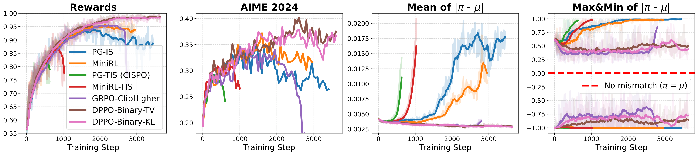

*Figure cue:* DPPO variants achieve stable training while controlling the training-inference mismatch at a low level. In contrast, methods without a trust region (PG-IS, CISPO) or with a misspecified one (MiniRL) suffer from growing mismatch and eventual collapse.

## Method Details
- 在有限时域、无折扣的 LLM 生成设定下，论文推导了专门的 performance difference identity 与 policy improvement bound，用最大 TV 散度为 trust-region 约束提供理论依据。
- 论文将 PPO clipping 重新解释为：它实际是在用采样 token 的概率比，近似期望意义下的策略散度；这个单样本近似会对低概率 token 的 ratio 过敏，却可能漏掉高概率 token 的大质量迁移。
- DPPO 仍采用 PPO 风格的 surrogate objective，但更新 mask 不再由 sampled-token ratio 决定，而是由直接估计的策略分布散度与阈值比较得到。
- 该 mask 只在更新方向会进一步偏离 trust region 时阻断梯度；把策略往更可信区域拉回的更新不会被拦截，从而保留 PPO 非对称裁剪里有利于优化的一面。
- 为降低内存开销，Binary 近似把完整词表压成“采样 token vs 其他 token”的 Bernoulli 分布；Top-K 近似则保留高概率 token 与采样 token、把剩余质量合并到 other 类别中，两者都被描述为真实散度的低开销下界近似。

## Experimental Setup And Evidence
实验大致分为稳定性诊断与更广泛设置验证两部分。稳定性分析中，作者在 DeepSeek-R1-Distill-Qwen-1.5B 上使用 1,460 道 MATH 题做 sanity test，比对 PG-IS、PG-TIS/CISPO、GRPO + Clip-Higher、MiniRL/MiniRL-TIS 与 DPPO（二值 KL 或 TV 变体），并显式分析 training-inference mismatch 与 trust-region 锚点选择。更广泛设置中，提取文本提到在 Qwen3-30B-A3B-Base、Qwen3-30B-A3B、Qwen3-8B-Base、OctoThinker-3B-Hybrid-Base 以及 Qwen3-1.7B-Base 上做了 AIME24/AIME25、标准 math reasoning、Arc1D、Acre、Sudoku-v0-easy 等任务验证，也比较了 Binary/Top-K 近似以及有无 rollout router replay。提取文本没有充分说明完整超参数、奖励定义、所有阈值取值、误差条和统计检验。

### Experiment Figure
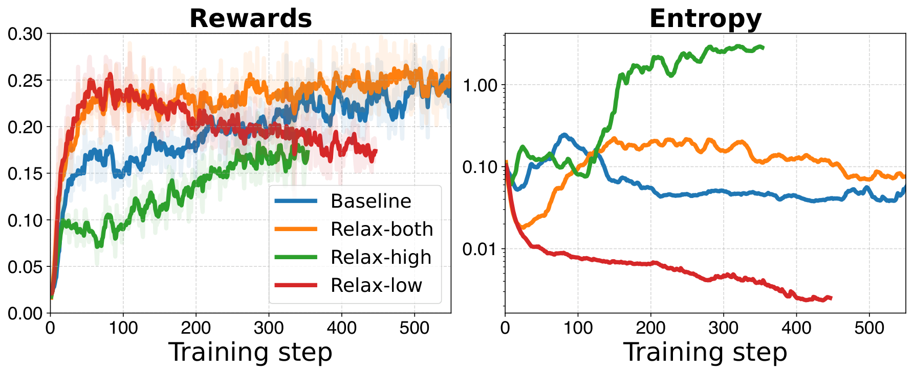

*Figure cue:* Analysis of trust region relaxation direction. (Left) Training reward curves. (Right) Policy entropy.

## Main Results And Claims
提取文本真正支持的结论主要有四类。第一，在 sanity test 中，无 trust region 的 PG-IS 与 PG-TIS/CISPO 会因训练-推理不匹配累积而崩溃，而 DPPO 变体能把 mismatch 控制在较低水平，并达到接近完美的最终 reward。第二，把 trust region 锚定到重算分布的 decoupled objective 会导致 mismatch 增长和性能崩溃，说明正确锚点应是 rollout policy。第三，图注显示，只屏蔽“大散度且有害”的负样本更新就足以稳定训练，说明这类更新是主要不稳定来源。第四，图注与方法片段都支持 DPPO 在 AIME24/AIME25 及多种模型/任务设置下，相比 GRPO 或 vanilla ratio-based PPO 具有更好的训练效率，且部分设置下最终性能也更好。具体提升幅度与统计稳健性，提取文本没有充分说明。

## Research Or Engineering Value
如果完整论文中的实验细节能够支撑摘要结论，这项工作的工程价值不低。它提供的不是又一个 PPO 变体超参，而是一个更合理的 trust-region 判据，理论上可直接替换到现有 PPO/GRPO 类 LLM RL 栈中，尤其适合经常遇到 collapse、training-inference mismatch 或 clip 调参困难的训练管线。对研究者而言，它也提供了一个更清晰的分析框架：应优先监控真实分布散度，而不是只看 sampled-token ratio。

## Relation To Prior Work
相对常见路线，这篇论文的差异不在于再调一个更宽或更窄的 clip，而在于把 PPO、GRPO、Clip-Higher、CISPO 一类方法共享的代理变量本身当作问题：这些方法大多仍以采样 token 的概率 ratio 为更新判据。与 TRPO 相比，DPPO 没有回到代价较高的二阶优化和全量约束，而是保留 PPO 式的一阶 surrogate + mask 结构，只把判据改成直接估计的 TV/KL 散度。与 Clip-Higher、CISPO、MiniRL 这类修补方案相比，作者强调根因不是 clipping 太紧或太松，而是 sampled-token ratio 与真实分布散度错位；同时其理论推导专门适配了 LLM 的有限时域、无折扣生成设定，并主张 trust region 应锚定 rollout policy 而不是重算分布。

## Overall Assessment
从给定文本看，这篇论文最值得信的是其问题诊断方向：在 LLM 的长尾大词表下，用 sampled-token ratio 充当 trust region 代理确实存在明确的结构性偏差，而文中的理论重述、示例分析、图注和稳定性实验趋势是相互一致的。最该怀疑的则是其外推力度和收益普适性：虽然片段支持 DPPO 在若干设置下更稳、更高效，且部分设置下最终性能更好，但提取文本没有充分说明完整数值、改进幅度、近似误差和跨任务覆盖面。因此，这更像一篇很值得优先精读的基础机制修正论文，而不是已经彻底终结 PPO 争议的最终定论。

## Technical Route Positioning
这篇论文属于 LLM 后训练中的 RL 优化算法路线，更具体地说是 trust-region / policy optimization 机制重设计。它处理的是 RL 微调链路里最底层的策略更新约束问题：在 token 级分布更新时，怎样定义一个比 PPO clipping 更贴近真实分布变化的 trust region，从而同时改善稳定性与训练效率。

## Scorecard
- Overall: 7.2/10
- Innovation: 8/10
- Technical Quality: 7/10
- Experimental Rigor: 6/10
- Writing Clarity: 7/10
- Practical Value: 8/10

## Strengths
- 问题抓得很准：直接质疑 LLM 强化学习里默认沿用的 sampled-token ratio trust region，而不是只做 PPO 小修小补。
- 理论与方法是连起来的：先把 trust-region 理论适配到 LLM 的有限时域生成，再给出可一阶实现的 DPPO。
- Binary 与 Top-K 近似让“显式散度约束”具备工程可落地性，而不是停留在全量分布不可算的理想化方案。
- 实验不仅报告结果趋势，还试图分解 instability 的来源、trust-region 是否必要、以及正确的 anchor 应该是什么。

## Future Work
- 在偏好对齐、RLHF/RLAIF、工具使用和开放式对话等非数学任务上验证 DPPO 是否仍优于 ratio clipping。
- 系统刻画 Binary 与 Top-K 近似的误差边界，明确它们在长尾 token、不同温度和超大词表下的失效区域。
- 研究散度阈值与 Top-K 大小的自适应选择，减少跨模型迁移时的人工调参。
- 进一步分离算法层面的 trust-region 失配与系统层面的 training-inference mismatch，各自贡献多大仍值得继续分析。

## Reading Checklist
- 先核对 LLM 场景下 performance difference identity 与 policy improvement bound 的假设条件，尤其是有限时域、无折扣和序列级奖励处理。
- 看清 DPPO 的 mask 判定规则：哪些正/负优势更新会被拦截，哪些“往 ratio=1 拉回”的更新会被放行。
- 检查 Binary 与 Top-K 近似为何可视为散度下界，以及它们在实现上到底额外保留了哪些 token。
- 重点读 trust-region anchor 实验，确认为什么 rollout policy 是正确锚点，以及 decoupled objective 为什么会失稳。

## Core Contributions
- 指出 PPO ratio clipping 在大词表 LLM 场景中不是无害近似，而会对高低概率 token 产生不对称约束。
- 提出 DPPO，用显式策略散度替代采样概率比率来定义 trust region。
- 给出 Binary 与 Top-K 近似，试图在不显著增加内存负担的前提下落地散度约束。

## Why Read It
- 它直接挑战了 LLM 强化学习里默认沿用的 PPO 设计假设，问题定义本身就值得优先核对。
- 如果结论成立，价值可能高于继续调 PPO 超参数，因为它改的是 trust region 的基本形式。
- 摘要同时覆盖算法合理性与工程可实现性，适合关注后训练基础设施的人快速筛查。

## Risks Or Limits
- 提取文本没有充分说明关键定量结果，当前无法判断收益幅度、方差、统计显著性和复现稳定性。
- Binary 与 Top-K 近似虽然直观，但在极长尾词表、不同采样温度或开放式生成场景下的误差边界，片段里没有展开。
- 现有可见证据主要围绕数学与推理类 RL 微调，对偏好对齐、通用聊天或其他奖励结构的外推还不能下结论。
- 如果散度阈值、Top-K 大小或 mask 方向规则对效果较敏感，提取文本没有充分说明其调参成本。

## Recommended For
- 关注 LLM 后训练与 RL 微调算法的研究者
- 维护 PPO 类训练栈、关心稳定性与效率的工程师
- 研究 trust region、策略优化与大动作空间强化学习的读者

## Keywords
- 大语言模型
- 强化学习
- PPO
- trust region
- 策略散度
- KL 散度

## Additional Figures

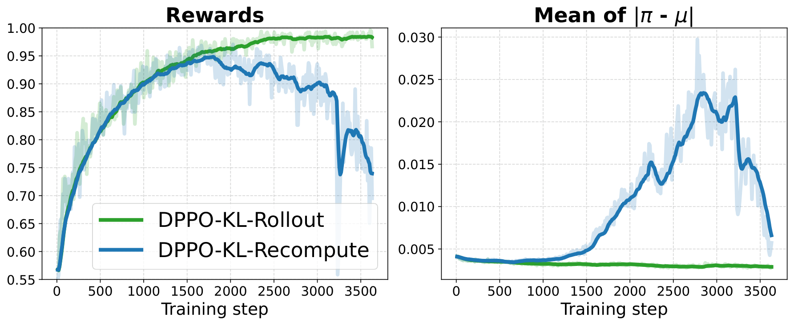

*Figure cue:* Switching the stable DPPO-KL to a decoupled objective causes the mismatch to grow and performance to collapse, confirming that the trust region must be anchored to the rollout policy.

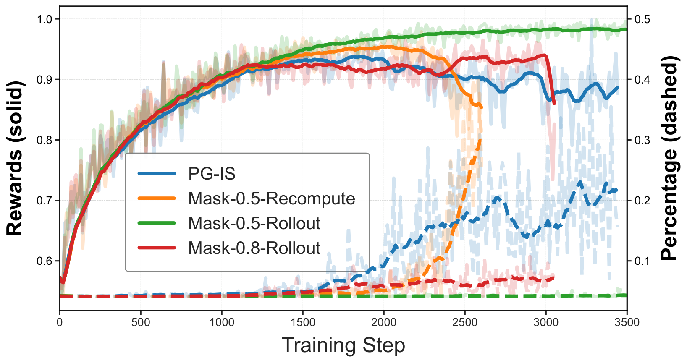

*Figure cue:* Isolating the source of instability. The solid curves are training rewards, while the dashed lines are the percentage of bad updates. Starting with the unstable PG-IS, applying a minimal mask that only blocks large-divergence bad updates on negative samples is sufficient to stabilize training, indicating these bad updates are the primary cause of training instability.

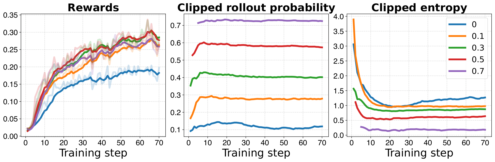

*Figure cue:* Analysis of relaxing trust regions for low-probability tokens. (Left) Training reward curves. (Middle) Rollout probability of clipped tokens. (Right) Entropy of clipped tokens.

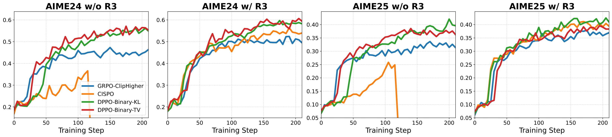

*Figure cue:* Evolution of AIME24 and AIME25 Avg@32 scores during RL training using Qwen3-30B-A3B-Base. 
 
 The first and third panels correspond to the same experiment without rollout router replay (w/o R3), while the second and fourth panels correspond to the same experiment with rollout router replay (w/ R3).

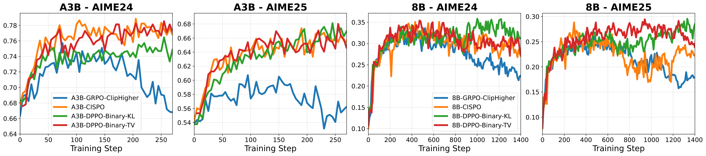

*Figure cue:* Evolution of AIME24 and AIME25 scores during RL training using Qwen3-30B-A3B (left) and Qwen3-8B-Base (right).

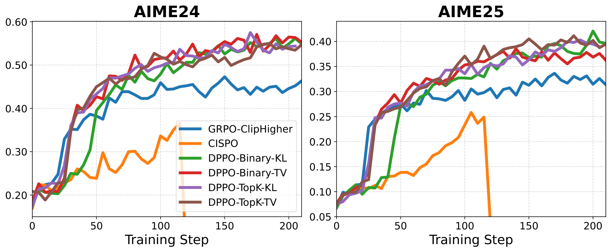

*Figure cue:* Evolution of AIME24 and AIME25 scores for baselines and DPPO with binary/Top-K (K=20) TV/KL approximation under the same setting as MoE Base w/o R3.

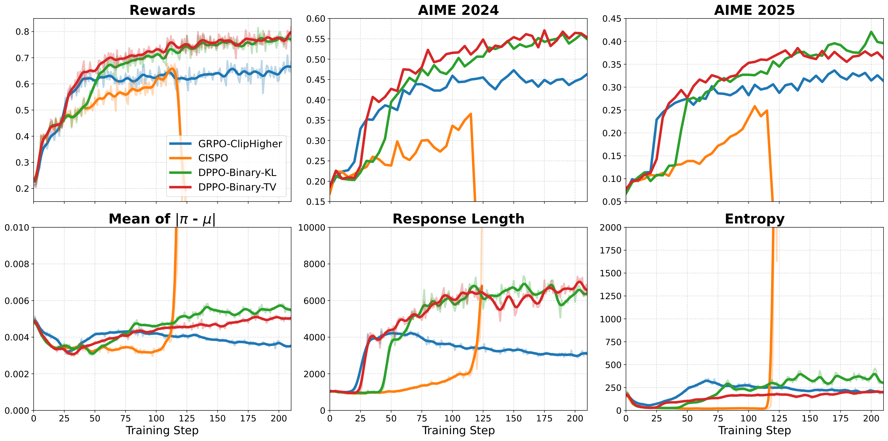

*Figure cue:* Evolution of metrics for MoE Base w/o R3 experiment (based on Qwen3-30B-A3B-Base, without rollout router replay).

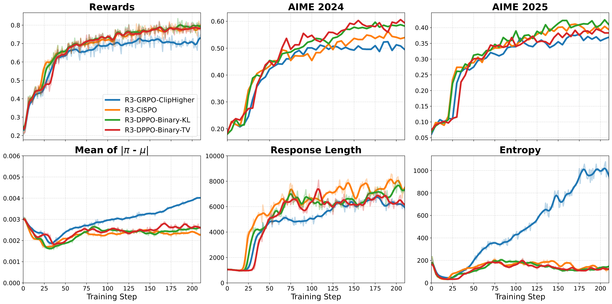

*Figure cue:* Evolution of metrics for MoE Base w/ R3 experiment (based on Qwen3-30B-A3B-Base, with rollout router replay).

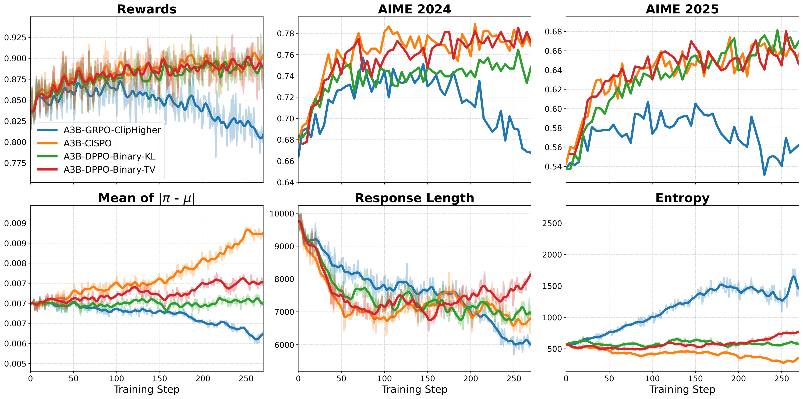

*Figure cue:* Evolution of metrics for MoE Thinking experiment (based on Qwen3-30B-A3B).

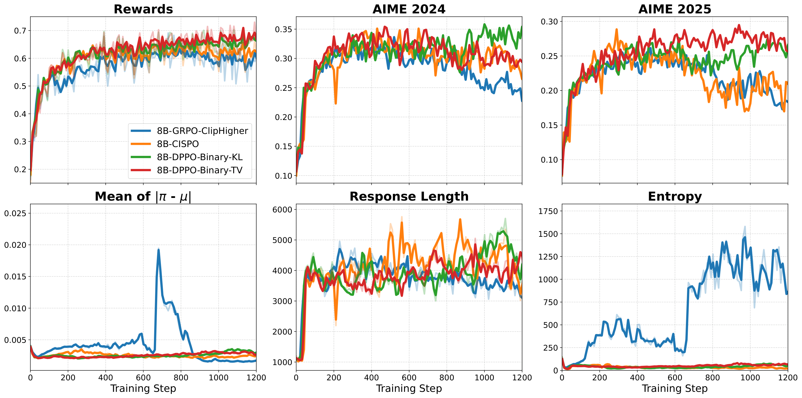

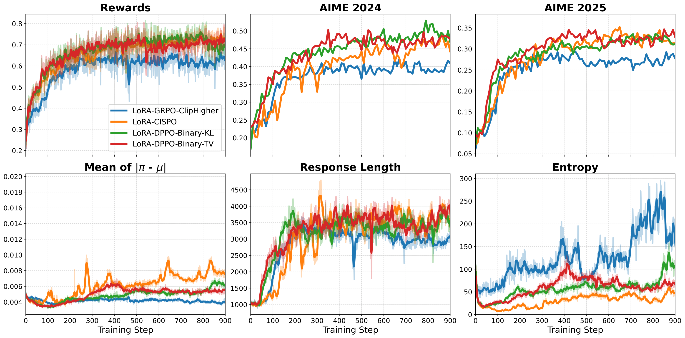

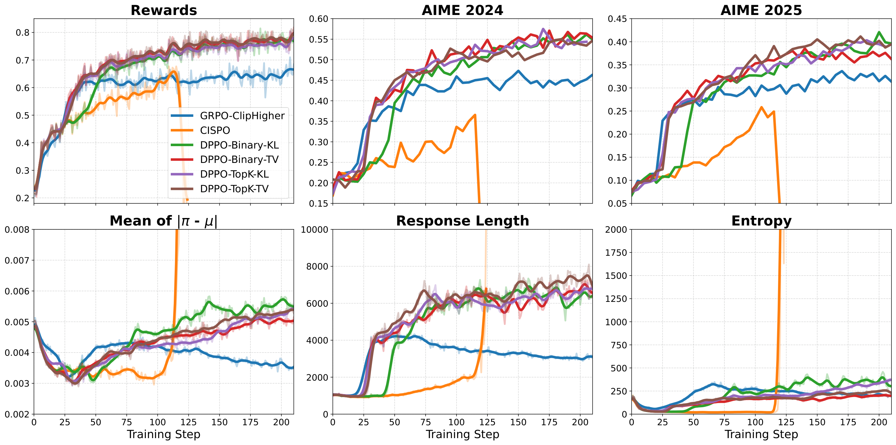

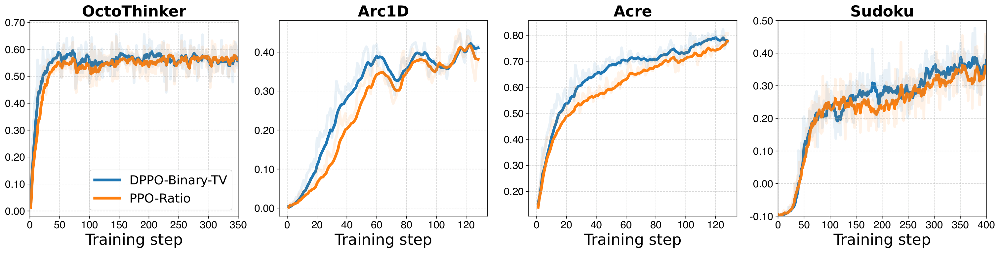

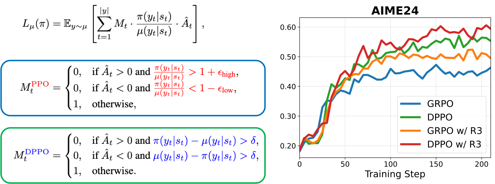

- Full asset manifest: [images/index.md](images/index.md)

## Abstract
Reinforcement learning (RL) has become a cornerstone for fine-tuning Large Language Models (LLMs), with Proximal Policy Optimization (PPO) serving as the de facto standard algorithm. Despite its ubiquity, we argue that the core ratio clipping mechanism in PPO is structurally ill-suited for the large vocabularies inherent to LLMs. PPO constrains policy updates based on the probability ratio of sampled tokens, which serves as a noisy single-sample Monte Carlo estimate of the true policy divergence. This creates a sub-optimal learning dynamic: updates to low-probability tokens are aggressively over-penalized, while potentially catastrophic shifts in high-probability tokens are under-constrained, leading to training inefficiency and instability. To address this, we propose Divergence Proximal Policy Optimization (DPPO), which substitutes heuristic clipping with a more principled constraint based on a direct estimate of policy divergence (e.g., Total Variation or KL). To avoid huge memory footprint, we introduce the efficient Binary and Top-K approximations to capture the essential divergence with negligible overhead. Extensive empirical evaluations demonstrate that DPPO achieves superior training stability and efficiency compared to existing methods, offering a more robust foundation for RL-based LLM fine-tuning.

## Recommendation Signals
- Recommendation score: 8.63
- Relevance score: 3.0
- Recency score: 3.0
- Popularity score: 2.0
- Quality score: 1.6

## Assets
- Extracted assets are stored in the `images/` folder next to this page.
- Browse the image manifest here: [images/index.md](images/index.md)
