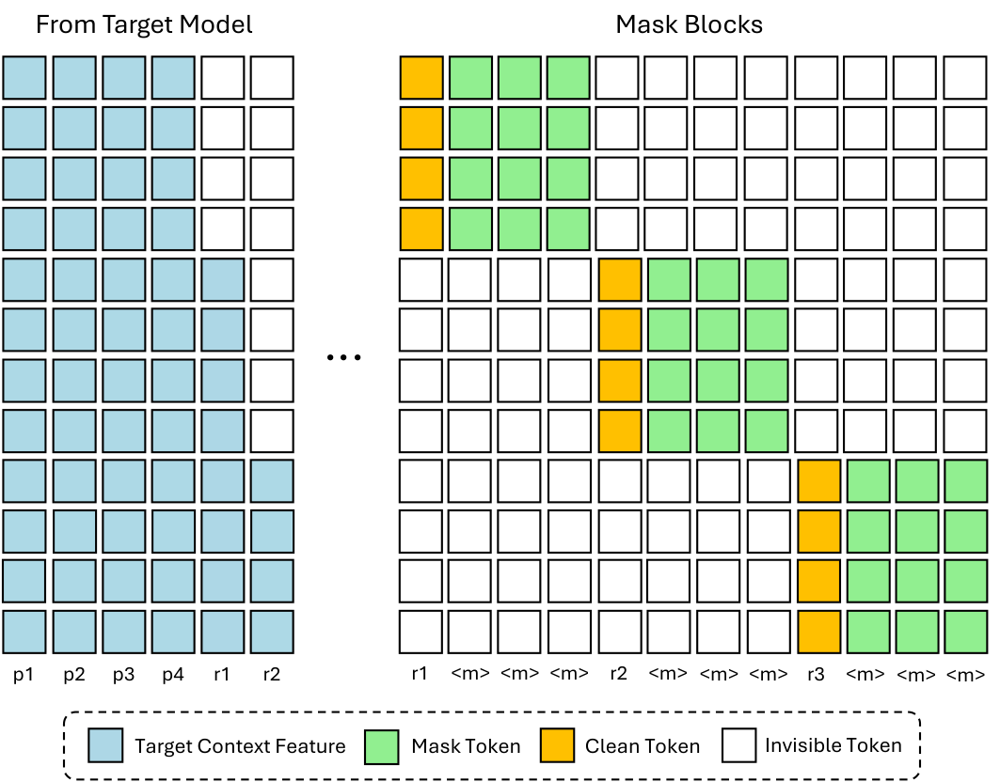
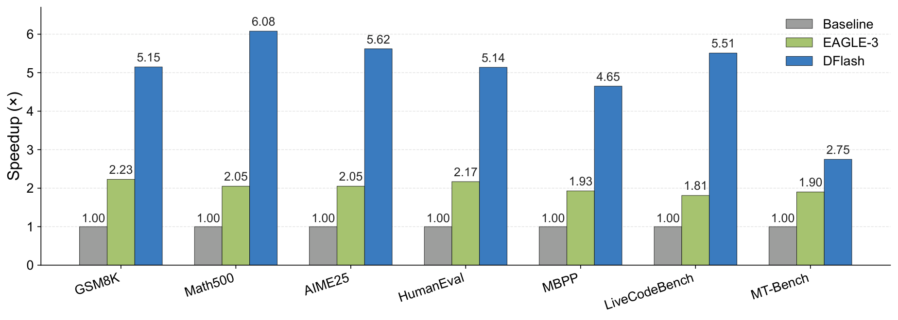
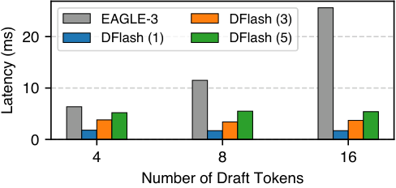

# DFlash: Block Diffusion for Flash Speculative Decoding

## TL;DR
这篇工作把 speculative decoding 的草稿阶段从自回归改成并行 block diffusion，试图突破现有方法“验证可并行、起草仍串行”的速度上限。

## 中文摘要
这篇工作针对 LLM 推理里 speculative decoding 的串行 drafting 瓶颈，提出用轻量级 block diffusion 模型一次前向并行生成候选 token，并利用从目标模型提取的上下文特征提高草稿质量和接受率。摘要声称该框架在多种模型与任务上实现了超过 6x 的无损加速，并且相对 EAGLE-3 最高可达到 2.5x 更高 speedup。对推理系统而言，这是很直接的低时延路线，但摘要没有充分说明硬件前提、训练与部署开销，以及收益究竟主要来自哪里。

## Quick Facts
- Paper ID: `2602.06036v1`
- Authors: Jian Chen, Yesheng Liang, Zhijian Liu
- Institutions: Institution information not extracted
- Domain: LLM Inference Systems
- Venue / Journal: arXiv preprint
- Citations: Citation count unavailable
- Published: 2026-02-05T18:59:30Z
- Source page: [open](http://arxiv.org/abs/2602.06036v1)
- PDF: [download](https://arxiv.org/pdf/2602.06036v1)
- Reading priority: high
- Why this priority: 与当前关注方向高度吻合：它直接面向 LLM inference latency 和 serving efficiency，并且给出了很强的 speedup claim。优先级高的原因不是摘要已经充分证明一切，而是它值得尽快核对硬件前提、lossless 定义、接受率机制以及与 EAGLE-3 的比较是否公平。

## Abstract Translation
自回归大语言模型虽然性能强，但解码天然串行，因此推理延迟高、GPU 利用率差。Speculative decoding 通过先用快速 draft model 生成候选、再由 target LLM 并行验证来缓解这一瓶颈，但现有方法的 drafting 仍多为自回归，串行性依旧限制了实际加速。Diffusion LLM 具备并行生成能力，是一个有前景的替代方向，但现有 diffusion 模型通常生成质量弱于自回归模型。本文提出 DFlash：用轻量级 block diffusion model 做并行 drafting，并利用从 target model 提取的上下文特征来提高草稿质量和接受率。摘要声称，DFlash 在多种模型和任务上实现了超过 6 倍的无损加速，并且相对当前最强 speculative decoding 方法 EAGLE-3，最高达到 2.5 倍更高的 speedup。

## Research Background And Motivation
自回归 LLM 的 decode 阶段逐 token 串行，既拉高延迟，也让推理更偏 memory-bound，难以充分利用 GPU。Speculative decoding 已能把验证阶段并行化，但主流方案的草稿生成仍是自回归，因此系统瓶颈开始集中到 drafting 端，长链路推理时尤其明显。

## Problem Framing
论文聚焦 speculative decoding 的核心上限：如果 draft model 仍逐步生成，那么 drafting cost 会随 speculation budget 线性增长，小 drafter 的容量也会让 acceptance length 很快饱和，最终限制端到端 speedup。作者要解决的是，能否在保持 lossless verification 的前提下，把 drafting 也改成并行 block 生成，同时保持足够高的 acceptance length。

## Method Overview
DFlash 将 diffusion LLM 重新定位为 speculative decoding 中的并行 drafter，而不是独立生成器。系统先让 target model 做标准 prefill，并从多个层抽取 hidden features；这些特征被融合后注入 draft model 每一层的 KV 投影，作为持续存在的条件上下文。随后，一个轻量级 block diffusion draft model 在单次前向中并行预测整个 token block，target model 再按 speculative decoding 机制并行验证，从而把 diffusion 的并行生成能力与自回归 target 的 lossless 保真结合起来。

### Method Figure


*Figure cue:* DFlash training attention. The target model provides context features (blue) that condition the draft model. The input consists of clean prompt tokens and clean response tokens . Within each masked block, a subset of clean response tokens (yellow) is randomly sampled as anchors, while mask tokens (green) mark positions for parallel prediction. Invisible tokens (white) denote the attention mask, which enforces causal consistency and prevents inter-block information leakage during training.

## Method Details
- Target model 在 prefill 后从若干浅到深的层提取 hidden states，将其拼接并通过轻量投影层融合成紧凑的 context feature。
- DFlash 不像 EAGLE-3 那样只把 target feature 当输入拼到 token embedding 上，而是把融合后的 context feature 直接注入 draft model 每一层的 Key/Value 投影，并缓存在 draft KV cache 中复用。
- Draft model 是轻量级 block diffusion 模型，一次前向并行预测一个 block 内所有 masked 位置，从而把 drafting cost 从随 token 数增长的串行多步调用，改成更接近固定开销的块级生成。
- 训练时不按固定分块直接做标准 block diffusion，而是随机采样 response 中的 anchor token，把 anchor 作为 block 首位、其后位置设为 mask，以匹配推理时“由 target 产出的干净 token 作为条件再并行预测后续 token”的行为。
- 训练采用稀疏注意力把多个 draft blocks 拼成一个序列联合优化，并对 block 内更靠前 token 施加更高的交叉熵权重；同时共享并冻结 target model 的 embedding 和 LM head，仅训练 draft Transformer 层。

## Experimental Setup And Evidence
实验在 LLaMA-3.1-Instruct-8B 与 Qwen3 系列（4B、8B、Coder-30B-A3B-Instruct）上进行，任务覆盖数学、代码和对话三类。正文说明大多数实验在 NVIDIA H200 上完成；SGLang 实验使用单张 B200 GPU，其中一组使用 FlashAttention-4 backend 并开启 Spec-v2 scheduling overlap，LLaMA-3.1 对比实验则在 SGLang/Flashinfer backend 上做。主要指标是平均 acceptance length、相对自回归 baseline 的端到端 speedup，以及 SGLang 吞吐。训练数据约 800K，来自 NVIDIA Nemotron Post-Training Dataset V2 和 CodeAlpaca，并用 target model 生成的响应重构训练样本；默认 draft model 为 5 层（Qwen3 Coder 为 8 层），block size 通常为 16（LLaMA-3.1 为 10），target hidden features 默认取 5 层。

### Experiment Figure


*Figure cue:* Speedup comparison between DFlash, EAGLE-3 against Autoregressive Decoding on Qwen3-8B~ with the Transformers backend. Overall, DFlash achieves more than 2.5× higher speedup than EAGLE-3.

### Evidence Table
*Table cue:* Throughput (tok/s), speedup over baseline, and average acceptance length on SGLang (FA4 backend).

```text
2 [2] * Task | 2 [2] * Method | Concurrency | 2 [2] * Avg.
(lr) 3-7 | 1 | 4 | 8 | 16 | 32
8 l Qwen3-4B
3 [2] * Math500 | Baseline | 316 | 1145 | 2201 | 4100 | 7136 | --
1531 | 4943 | 9066 | 14477 | 20417 | 8.01
4.8 | 4.3 | 4.1 | 3.5 | 2.9
3 [2] * Human-
Eval | Baseline | 312 | 1162 | 2217 | 4184 | 7143 | --
```

## Datasets And Benchmarks
- 训练数据：约 800K 样本，来自 NVIDIA Nemotron Post-Training Dataset V2 与 CodeAlpaca，训练响应由 target model 生成以提升 target alignment。
- 训练数据（LLaMA-3.1 对比实验）：UltraChat、ShareGPT。
- 数学评测：GSM8K、MATH、AIME24、AIME25、Math500。
- 代码评测：HumanEval、MBPP、LiveCodeBench。
- 对话评测：MT-Bench、Alpaca。

## Baselines
- Vanilla autoregressive decoding。
- EAGLE-3；Qwen3 instruct 实验中比较了 tree size 16 和 60，两者都设定 7 个 draft steps 与 top-k 10。
- 无 target context feature 的 5-layer block diffusion drafter（作为方法消融对照）。

## Metrics
- 端到端 decoding speedup（相对 autoregressive baseline）。
- 平均 acceptance length。
- SGLang 吞吐（tok/s 或 TPS）。

## Ablations And Analysis
- 无 target context feature 的 5 层 diffusion drafter只能得到较温和 speedup，说明 target hidden feature conditioning 是 acceptance 的关键来源。
- Draft layer 数量存在成本-质量折中：8 层通常带来更长 acceptance，但 5 层在平均 speedup 上最好。
- 增加 target hidden features（3-H 到 5-H）会提升 acceptance length 与 speedup，但离线缓存 hidden state 的存储成本线性增加。
- 训练时随机采样 anchor 构造 masked blocks，优于标准均匀分块，表中在 Math500、HumanEval、MT-Bench 上都带来更高 speedup 与 acceptance。

### Analysis Figure


*Figure cue:* Draft cost of 1, 3, 5-layer DFlash and 1-layer EAGLE-3.

## Evaluation Validity And Fairness
- 实验覆盖 Qwen3 与 LLaMA-3.1 两个 target family，并包含数学、代码、对话、instruct、reasoning 和 SGLang serving 场景，覆盖面相对完整。
- 硬件与 serving 条件写得比较明确：正文说明大多数实验在 H200 上，SGLang 实验在单张 B200 上，并注明了 FA4、Flashinfer、Spec-v1/v2 等后端或调度设置。
- 与 EAGLE-3 的对比给出了公开 checkpoint 来源，并在 Qwen3 上比较了 tree size 16 与 60 两种设置，有助于覆盖不同 drafting/verification trade-off。
- 未直接对比 DiffuSpec、SpecDiff-2 等 diffusion-based speculative decoding 方法，作者给出的原因是缺少开源实现，因此它在同类 diffusion drafter 内部的相对位置仍不完全清楚。

## Main Results And Claims
提取文本支持的主要结论是：DFlash 在多模型多任务上实现了超过 6x 的 lossless acceleration，文中还明确给出在 Qwen3-8B 上最高 6.1x speedup；相对 EAGLE-3，整体上可达到接近 2.5x 的更高 speedup。在 Qwen3 instruct setting 下，greedy decoding 的平均 speedup 为 4.9x，temperature=1 时为 4.1x，并且都优于 EAGLE-3；正文还指出其也超过了 tree size 60 的 EAGLE-3 设定。在 reasoning model 上，文本给出 speedup 约为 4.5x 和 3.9x。在 SGLang 单 B200、FA4 backend、concurrency 1 到 32 的实验中，Qwen3-8B 最高达到 5.1x speedup。消融结果进一步表明，5 层 draft model 的平均 speedup 最好，更多 target hidden features、随机采样 anchor 的训练方式和合适的 block size 设计都能提升 acceptance 与端到端效率。

## Research Or Engineering Value
如果文中的 speedup 在公平 baseline 和真实 serving 负载下成立，这项工作的工程价值很直接：它给 speculative decoding 增加了一条新的高收益草稿路线，不需要替换 target autoregressive model，就有机会同时改善 latency、throughput 和 GPU 利用率。对研究者来说，它更重要的启发是把 diffusion 从“要不要取代 AR 生成器”转成“如何作为高并行 runtime 模块服务 AR 推理”。但它的实用性仍明显依赖硬件前提、target hidden feature 接入能力，以及额外训练与缓存开销是否可接受。

## Relation To Prior Work
相对常见的 speculative decoding 路线，DFlash 的差异不在于继续压缩 autoregressive drafter，而在于把 drafting 本身改成 block-level diffusion 并行生成。相对 EAGLE-3 这类 feature-guided AR drafter，它不是把 target hidden feature 只作为浅层输入，而是把融合后的 target context 持续注入每一层 draft KV，使更深的 drafter 仍能稳定利用 target 信息。相对把 diffusion 当作完整生成器、或直接使用大体量 diffusion drafter 的路线，DFlash 明确把 diffusion 限制在 drafting 阶段，借助 AR target 做 lossless 验证，因此它更像 runtime 协同设计，而不是用 diffusion 取代 autoregressive LLM。

## Overall Assessment
从提取文本看，这是一篇很典型、也很值得 systems 方向优先核对的 LLM inference 论文：它不是泛泛把 diffusion 搬到语言模型上，而是准确切入 speculative decoding 中最难再提速的一段，即串行 drafting。最值得信的部分，是方法-收益链路相对闭环：并行 block drafting、target hidden feature 的层间持续条件化、以及围绕层数/hidden features/block 构造的消融，基本都支持“acceptance 提升 + drafting latency 降低”这个主叙事。最该怀疑的部分，是外部可迁移性和完整系统成本：作者没有与其他 diffusion speculative 方法直接比较，单卡 H200/B200 之外的硬件和部署边界不清楚，target hidden feature 抽取与缓存的额外代价也没有被充分拆开。因此，这篇论文当前最像一条非常有潜力的 runtime 协同路线，而不是已经被完全验证的通用 serving 方案。

## Technical Route Positioning
这篇论文属于 LLM inference runtime / speculative decoding 加速路线，具体处在“草稿生成器设计”这一段，而不是主模型架构创新、kernel 优化或编译器代码生成。它试图解决的不是 verification 并行化本身，而是 speculative decoding 链路里剩余的串行 drafting 瓶颈：用轻量 block diffusion drafter 在单次前向中并行生成 token block，再由自回归 target 做 lossless 验证。系统收益的核心假设是单卡 GPU 上块级并行比多次串行草稿更高效，同时 target hidden feature 可显著提高 acceptance。

## Scorecard
- Overall: 7.2/10
- Innovation: 7/10
- Technical Quality: 7/10
- Experimental Rigor: 6/10
- Writing Clarity: 8/10
- Practical Value: 8/10

## Related Paper Comparisons
- [Multi-Token Prediction via Self-Distillation](/papers/2602-06019v1-multi-token-prediction-via-self-distillation/) (同为 LLM 解码加速): 该文的摘要路线是把原始自回归模型训练成可直接做 multi-token prediction 的单模型部署形态，核心变化发生在主模型训练目标上；DFlash 则保留 draft-verifier 两阶段 speculative decoding，只把 drafting 从自回归改成 block diffusion，并通过 target hidden feature 提高 acceptance。前者更像单模型训练后部署路线，后者更像推理时的 runtime 协同与 lossless speculative 系统设计。
- [Stop the Flip-Flop: Context-Preserving Verification for Fast Revocable Diffusion Decoding](/papers/2602-06161v1-stop-the-flip-flop-context-preserving-verificati/) (都涉及 diffusion 风格并行解码): COVER 面向 diffusion decoding 自身的 revocable verification，解决的是 flip-flop 导致的上下文破坏问题，关键机制是验证阶段的 KV cache override；DFlash 则把 diffusion 限定为 speculative drafting 的并行候选生成器，再由自回归 target 验证，目标是打破 AR drafter 的串行速度上限。两者都关心并行生成时的上下文利用，但 DFlash 解决的是 AR serving 链路中的 draft latency/acceptance trade-off，而不是 diffusion decoder 的 revision 稳定性。

## Strengths
- 问题抓得很准：它直接针对 speculative decoding 中仍然残留的串行 drafting 瓶颈，而不是泛泛做更快的小模型。
- 方法链路清晰：并行 block diffusion drafting + target hidden feature conditioning + speculative verification，系统因果关系比较自洽。
- KV 注入而不是浅层输入拼接，是相对常见 feature-guided drafter 路线的一个关键差异点，也有对应的层数消融支持。
- 实验不只停留在离线 Transformers 结果，还覆盖 SGLang、reasoning mode 和不同 concurrency，说明作者在意真实 serving 场景。

## Future Work
- 做自适应 block-size scheduling，在 compute-bound 场景下根据 batch/concurrency 动态切换 block size。
- 补齐与 DiffuSpec、SpecDiff-2 等 diffusion-based speculative decoding 方法的直接公平比较。
- 量化 target hidden feature 提取、KV 注入和离线缓存带来的显存、带宽与训练/部署成本。
- 验证在更多 target family、多卡 serving、长上下文和更复杂采样设置下的稳定性与收益边界。

## Reading Checklist
- 先核对 DFlash 的单次 block diffusion forward 在实现上到底有多少 denoising 步，以及 speedup 主要来自 draft latency 降低还是 acceptance 提升。
- 检查 KV injection 的代价：抽 5 层 target hidden feature、做 projection 并写入每层 draft KV cache，会增加多少额外显存和带宽。
- 核对与 EAGLE-3 的公平性，尤其是 tree size 16/60、verification overhead、backend 差异以及是否在相同 lossless 约束下比较。
- 关注 target-aligned 训练数据的构造方式：target model 自生成响应是否让方法对特定 target 过拟合，换模型是否需要重训。

## Core Contributions
- 提出用轻量级 block diffusion 模型做 speculative decoding 的并行草稿生成，而不是继续依赖自回归 draft model。
- 通过单次前向生成一个 token block，并结合来自目标模型的上下文特征来提升草稿质量与接受率。
- 摘要声称在多模型多任务上实现超过 6x 的无损加速，并在 speedup 上超过 EAGLE-3。

## Why Read It
- 它直接命中当前 LLM serving 的核心瓶颈之一：speculative decoding 里仍然残留的串行 drafting。
- 如果论文细节站得住，这可能是比常规 draft-model 优化更有潜力的系统级提速方向。
- 它把 diffusion 的价值重新放回 inference runtime 协同设计，而不是泛泛讨论生成模型替代路线。

## Risks Or Limits
- 未与其他 diffusion-based speculative decoding 方法直接比较，因此“比同类 diffusion drafter 更强”这一层结论目前不能下得太满。
- 方法依赖 target model 内部 hidden features，并且训练数据用 target model 自生成响应构造，说明它较强依赖 target-specific 协同；跨模型复用边界不清楚。
- 正文虽然给出 speedup 和部分 throughput/acceptance，但显存占用、feature cache 成本、hidden extraction 开销的完整系统 breakdown 提取文本没有充分说明。
- 实验主要围绕单 GPU 的 H200/B200 设置，多卡部署、跨硬件可迁移性、极长上下文下的收益边界，提取文本没有充分说明。

## Recommended For
- 做 speculative decoding、serving runtime 和 decode latency 优化的 LLM systems 研究者。
- 关注 acceptance rate、吞吐/延迟折中以及草稿模型设计的推理工程师。
- 想评估 diffusion-style 并行生成是否适合作为 inference 协同模块的人。

## Keywords
- speculative decoding
- block diffusion
- parallel drafting
- LLM inference systems
- latency optimization

## Additional Assets
- 其余提取到的 figures 保存在 `images/` 目录，默认不全部展开，避免让页面被资产列表主导。
- Full asset manifest: [images/index.md](images/index.md)

## Abstract
Autoregressive large language models (LLMs) deliver strong performance but require inherently sequential decoding, leading to high inference latency and poor GPU utilization. Speculative decoding mitigates this bottleneck by using a fast draft model whose outputs are verified in parallel by the target LLM; however, existing methods still rely on autoregressive drafting, which remains sequential and limits practical speedups. Diffusion LLMs offer a promising alternative by enabling parallel generation, but current diffusion models typically underperform compared with autoregressive models. In this paper, we introduce DFlash, a speculative decoding framework that employs a lightweight block diffusion model for parallel drafting. By generating draft tokens in a single forward pass and conditioning the draft model on context features extracted from the target model, DFlash enables efficient drafting with high-quality outputs and higher acceptance rates. Experiments show that DFlash achieves over 6x lossless acceleration across a range of models and tasks, delivering up to 2.5x higher speedup than the state-of-the-art speculative decoding method EAGLE-3.

## Recommendation Signals
- Recommendation score: 9.8
- Relevance score: 3.0
- Recency score: 3.0
- Popularity score: 2.4
- Quality score: 2.0
- Analysis candidate score: 9.28
- Analysis priority rank: 1
- Analysis signals: speculative decoding, latency, speedup

## Assets
- Extracted assets are stored in the `images/` folder next to this page.
- Browse the image manifest here: [images/index.md](images/index.md)
