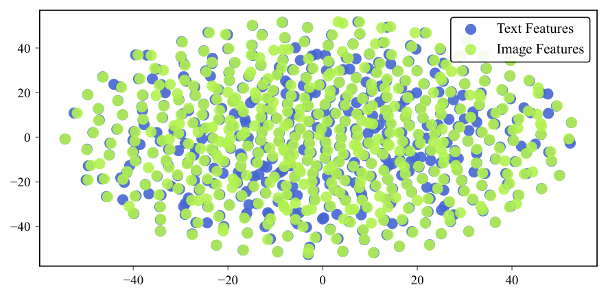
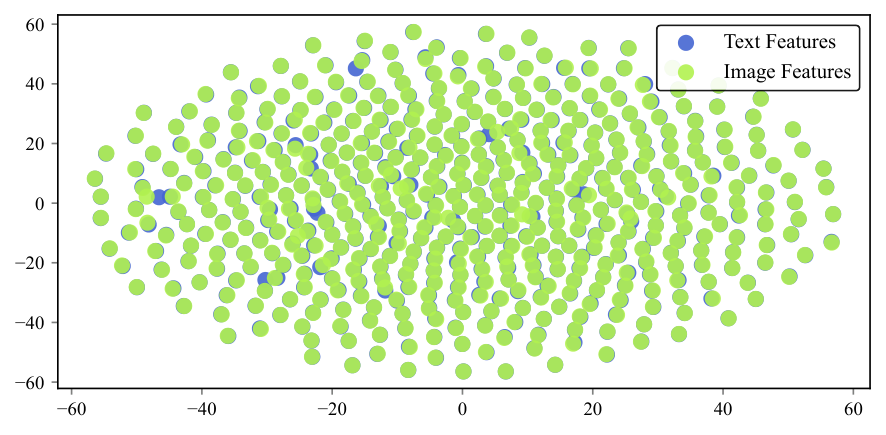
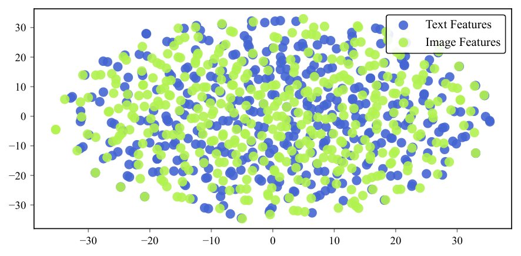
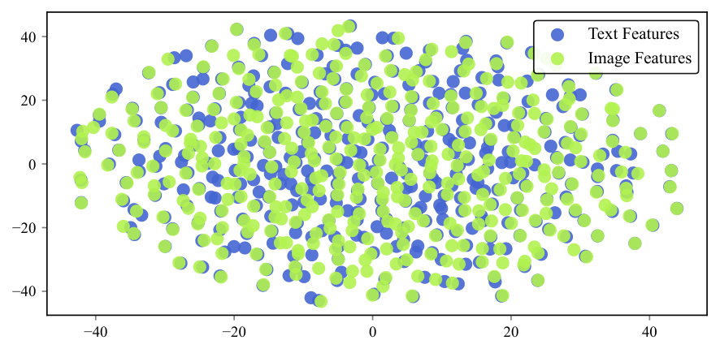
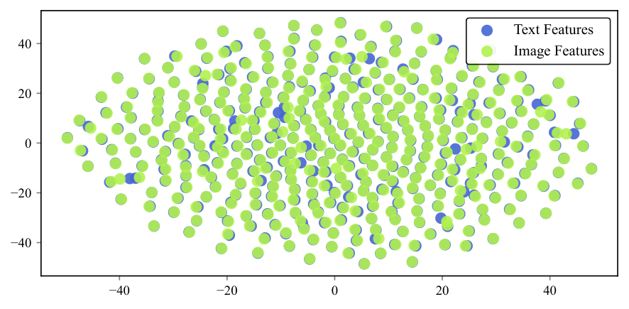

# Mario: Multimodal Graph Reasoning with Large Language Models

## TL;DR
这篇工作把多模态图上的结构信息、跨模态对齐和面向LLM的推理接口放进同一框架里，目标明确对准当前多模态系统缺少关系建模的问题。

## 中文摘要
论文关注多模态图推理：节点同时含文本和视觉属性，边提供结构线索，而现有方法常把图像-文本对独立编码，难以利用图拓扑。作者提出 Mario，两阶段处理跨模态一致性不足和不同节点偏好不同模态这两个问题，先用图条件约束的 VLM 做细粒度对齐，再用模态自适应的图指令调优把最合适的模态视图送入 LLM。摘要说明作者在多个多模态图基准上做了广泛实验，但结果细节、比较对象和增益来源在给定摘要里没有充分说明。

## Quick Facts
- Paper ID: `2603.05181v1`
- Authors: Yuanfu Sun, Kang Li, Pengkang Guo, Jiajin Liu, Qiaoyu Tan
- Domain: Multimodal
- Published: 2026-03-05T13:49:41Z
- arXiv: [abstract](https://arxiv.org/abs/2603.05181v1)
- PDF: [download](https://arxiv.org/pdf/2603.05181v1.pdf)
- Reading priority: high
- Why this priority: 这篇论文同时命中当前关注的多模态与大模型方向，问题定义也比常见图文建模更贴近真实结构化推理需求。虽然摘要未给出完整实验结论，但方法层面的信息量较高，适合作为今日优先核对的一篇。

## Abstract Translation
近年来，大语言模型（LLM）的进展为多模态推理开辟了新路径。然而，大多数现有方法仍依赖预训练视觉语言模型（VLM）对孤立的图文对进行编码，忽视了真实世界多模态数据天然形成的关系结构。这促使我们考虑在多模态图（MMG）上进行推理：其中每个节点都具有文本和视觉属性，边则提供结构线索。在保留图拓扑的前提下，让 LLM 对这类异构多模态信号进行推理会带来两个关键挑战：解决较弱的跨模态一致性，以及处理异质的模态偏好。为此，我们提出 Mario，一个统一框架，同时应对上述两项挑战，并实现基于 LLM 的高效 MMG 推理。Mario 包含两个创新阶段。首先，设计图条件化的 VLM，在图拓扑引导下通过细粒度跨模态对比学习联合优化文本与视觉特征。其次，提出模态自适应的图指令调优机制，将对齐后的多模态特征组织成图感知的指令视图，并通过可学习路由器为每个节点及其邻域选择最有信息量的模态配置提供给 LLM。在多个 MMG 基准上的大量实验表明，Mario 在监督和零样本两种场景下的节点分类与链接预测任务中都持续优于当前最强的图模型。

## Research Background And Motivation
多模态推理正在从孤立图文对理解转向带关系结构的实体集合建模，尤其在文档、商品、社区和知识实体等场景里，节点关系本身就是关键信号。现有常见做法通常先用 VLM 独立编码节点图文，再把表示交给图模型或 LLM，但这默认图文已经对齐、且不同节点依赖的模态重要性一致，这在真实多模态图中往往不成立。

## Problem Framing
论文要解决的是：如何让 LLM 在保留图拓扑的同时，对同时含文本和图像属性的多模态图进行有效推理。作者把问题拆成两个前置障碍：一是节点内部图文经常弱一致，直接编码和传播会放大跨模态错配；二是不同节点及其邻域真正有用的模态配置并不相同，固定提示模板会系统性浪费信息。

## Method Overview
Mario 采用两阶段路线。第一阶段先训练图条件化视觉语言模型 GVLM，在图结构约束下把文本与图像表示对齐成结构感知的节点表示；第二阶段再把这些表示组织成多种图感知提示视图，并用模态自适应路由器为每个节点及其邻域选择最有用的提示形式，交给经过指令调优的 LLM 完成节点分类或链接预测。

### Method Figure

*Figure cue:* Overview of the proposed Mario framework. Given a MMG, Stage 1 uses a graph-conditioned vision–language model to perform structure-aware image–text alignment: images and texts are initially encoded, symmetrically refined by a Transformer-embedded Mixer that injects graph structure into token embeddings, and then aligned via contrastive learning. Stage 2 builds on these aligned features with modality-adaptive graph instruction tuning, where a lightweight router, trained under LLM supervision (a),

## Method Details
- Stage 1 使用文本塔和图像塔分别编码节点模态，初始表示来自预训练视觉语言表示，并以 [CLS] 向量作为节点级摘要。
- 在每层中，Topology-Aware Multimodal Mixer 收集当前图或采样节点集的 [CLS] 表示，执行带图结构偏置的多头注意力；该偏置按最短路径距离分桶，用可学习标量编码结构角色。
- Mixer 输出的结构感知向量会回灌到各模态 token 序列中替换原 [CLS]，使后续 Transformer 层在保留细粒度 token 或 patch 信息的同时逐层吸收图上下文。
- Stage 1 末尾对图条件化后的文本和图像节点表示做双向、温度缩放的对称 InfoNCE；同一节点的图文对是正样本，batch 内跨节点组合是负样本，从而把跨模态对齐和结构信息绑定起来。
- Stage 2 为每个节点构造 text-only、image-only、multimodal 三种模板，用特殊图 token 注入节点及其 Top-k 的 1-hop/2-hop 邻居信息；MAPR 以节点多模态表示、邻域均值池化表示和对数度为输入，结合按模板 loss 得到的后验分布做概率路由训练，推理时改为硬路由只选一个模板。

## Experimental Setup And Evidence
实验按四个研究问题组织：RQ1 比较 Mario 与不同模态输入的主流基线在标准多模态图任务上的表现；RQ2 检查在完全未见 MMG 上的 zero-shot 泛化；RQ3 做 GVLM 与指令调优相关的消融；RQ4 分析 MAPR 相对单模板策略的性能与效率。任务至少覆盖节点分类和链接预测，场景包含监督与 zero-shot，并辅以 t-SNE、训练曲线以及与 MMGCN、MGAT、额外 GNN 的补充比较。具体数据集名称、样本规模、评价指标、所用 LLM/VLM 型号和超参数，提取文本没有充分说明。

### Experiment Figure

*Figure cue:* (a) Cosine similarity between text and image embeddings across three models on four datasets.
(b) Venn diagram over three prompt templates with different modality inputs: Text-Only, Image-Only, and Text+Image. Each colored circle corresponds to one template; numbers in each region give the proportion of nodes that can be correctly classified only by that template or by the union of the templates whose regions overlap (where overlapping regions blend the colors). Results are averaged over four da

## Main Results And Claims
提取文本支持以下结论：Mario 在多个 MMG 基准上的节点分类与链接预测中，在监督和 zero-shot 场景下都优于已有图模型，且零样本迁移最高可达 1.6× 增益。把图拓扑引入跨模态对齐后，文中报告跨模态一致性相对 frozen CLIP 平均提升 68%，相对逐节点微调再提升 6%。图 1 对三种模板的分析表明它们存在明显互补性，约 30% 的节点只能被其中一种或两种模板正确分类。训练分析还报告，MAPR 相比单模板基线可在大约一半 epoch 内收敛且 loss 更低，而推理阶段通过硬路由不增加相对单模板流水线的额外计算。

## Research Or Engineering Value
如果论文结论成立，Mario 对需要同时利用节点内容和关系上下文的多模态系统有直接参考价值，例如带图像属性的商品图、社区图、文档图和知识增强系统。它的工程意义不只是某个模块替换，而是提供了一条可复用链路：先做结构感知的图文对齐，再把多模态图证据整理成 LLM 可选择、可路由的提示接口。

## Relation To Prior Work
相对常见的“先用 VLM 独立编码每个节点的图文，再交给 GNN 或 GraphLLM 做传播/推理”的路线，Mario 把结构信息前移到跨模态对齐阶段，而不是默认图文天然同步。相对固定单模板的 GraphLLM，它进一步把节点级模态选择显式建模成路由问题，而不是所有节点共享同一种提示方式。按文中自述，相比先把图文融合成共享查询再对齐的方法，它更强调保留模态差异后再做选择；相比主要面向缺模态场景的方法，它针对的是更常见的“模态齐全但一致性弱、偏好异质”的设置。

## Overall Assessment
这篇论文最值得信的部分是问题拆解和方法链路：作者没有把 MMG 视为简单的“图文编码后接图模型”，而是明确提出先解决跨模态弱一致性，再解决节点级模态偏好，并给出了与此对应的两阶段机制，且提取文本里确实有对齐提升、模板互补和训练收敛这类支持性证据。最该怀疑的部分是结果幅度与泛化边界：虽然文本声称在监督和 zero-shot 任务上稳定超过 SOTA，并给出若干百分比，但完整数据集设置、基线细节、指标和统计可信度在提取文本中不完整，因此当前更适合把它判断为“问题定义强、方法设计成体系、实验结论仍需细读正文确认”的论文。

## Technical Route Positioning
这篇论文属于“多模态图学习 + LLM 指令化推理”的技术路线，位于从原始图文节点到大模型推理之间的桥接层。它解决的不是通用 VLM 预训练本身，也不是纯下游图分类器设计，而是“如何先把图结构纳入跨模态表示，再把这些表示整理成适合 LLM 动态消费的输入接口”这一中间链路问题。

## Scorecard
- Overall: 6.8/10
- Innovation: 7/10
- Technical Quality: 7/10
- Experimental Rigor: 6/10
- Writing Clarity: 7/10
- Practical Value: 7/10

## Strengths
- 问题定义抓得准，不是把多模态图当成“图文对加一层图网络”，而是明确指出弱对齐和模态偏好异质这两个更接近真实数据的问题。
- 方法链路完整，从结构感知表示对齐一直走到 LLM 可消费的提示接口，不只是单独改编码器或单独改提示。
- Stage 1 的图偏置注意力和 [CLS] 回灌机制比较具体，说明作者试图在 token 级表示与图级结构之间建立可训练耦合。
- 证据类型相对丰富，除了主任务结果，还给出对齐分析、模板互补性、训练效率和可视化，至少能支撑方法设计背后的动机。

## Future Work
- 把当前三种固定视图扩展为更细粒度的模态组合，或支持文本、图像之外的更多模态。
- 研究端到端联合训练是否优于当前先对齐再指令调优的串行两阶段流程。
- 在更大规模图和更长邻域上下文中验证全局 mixer、邻居检索与模板构造的扩展性。
- 系统分析训练节点作为 in-context exemplar 的偏置、鲁棒性和迁移边界。

## Reading Checklist
- 核对 GVLM 中 graph-aware position bias 的具体分桶方式、最短路径距离上限以及是否有对应消融。
- 核对三种模板的 token 设计、Top-k 邻居选择规则、1-hop/2-hop 配置，以及标签注入是否会影响公平比较。
- 核对 MAPR 的输入特征、KL 项权重、soft routing 到 hard routing 的切换细节，以及是否有可解释性分析。
- 核对 zero-shot transfer 的实验协议：未见 MMG 的定义、训练/验证/测试隔离方式，以及是否真正跨数据集或跨域。

## Core Contributions
- 提出面向多模态图推理的统一框架，把跨模态对齐、图结构利用和 LLM 推理接口整合到同一流程中。
- 引入图条件约束的 VLM 对齐机制，用图拓扑指导细粒度跨模态表示优化。
- 提出模态自适应的图指令调优与可学习路由机制，尝试按节点及邻域动态选择更合适的模态视图供 LLM 使用。

## Why Read It
- 问题设定贴近当前多模态系统的真实瓶颈：不仅要看图文内容，还要处理对象之间的结构关系。
- 方法新意不只是再加一个图编码器，而是把“对齐问题”和“模态选择问题”拆开处理，并明确对接 LLM。
- 如果你关心多模态 Agent、文档图、实体关系理解或图增强推理，这篇文章的框架思路值得快速核对。

## Risks Or Limits
- 提取文本没有充分说明所用数据集、评价指标、LLM/VLM 规模、方差或显著性检验，因此主结果强度还需要看完整表格。
- 两阶段训练加三模板训练会增加实现与训练复杂度；文中虽然强调推理不增算力，但 Stage 2 明确需要每个样本三次前反向。
- 路由器的稳定性、可解释性以及在更大规模图上的扩展性，提取文本没有充分说明。
- zero-shot 迁移的具体定义、跨图还是跨域、以及训练节点作为 in-context exemplar 的敏感性，提取文本没有充分说明。

## Recommended For
- 关注多模态图学习与 LLM 结合的研究者
- 在做视觉-文本关系推理、文档图或结构化多模态系统的工程师
- 想了解如何把图结构信息更自然接入大模型推理链路的读者

## Keywords
- 多模态图
- 大语言模型
- 视觉语言模型
- 跨模态对齐
- 图推理
- 指令调优

## Additional Figures

*Figure cue:* Movies

*Figure cue:* Movies

*Figure cue:* Movies – Frozen CLIP

*Figure cue:* Movies – Frozen CLIP

*Figure cue:* Movies – Frozen CLIP

*Figure cue:* Movies – Frozen CLIP

- Full asset manifest: [images/index.md](images/index.md)

## Abstract
Recent advances in large language models (LLMs) have opened new avenues for multimodal reasoning. Yet, most existing methods still rely on pretrained vision-language models (VLMs) to encode image-text pairs in isolation, ignoring the relational structure that real-world multimodal data naturally form. This motivates reasoning on multimodal graphs (MMGs), where each node has textual and visual attributes and edges provide structural cues. Enabling LLM-based reasoning on such heterogeneous multimodal signals while preserving graph topology introduces two key challenges: resolving weak cross-modal consistency and handling heterogeneous modality preference. To address this, we propose Mario, a unified framework that simultaneously resolves the two above challenges and enables effective LLM-based reasoning over MMGs. Mario consists of two innovative stages. Firstly, a graph-conditioned VLM design that jointly refines textual and visual features through fine-grained cross-modal contrastive learning guided by graph topology. Secondly, a modality-adaptive graph instruction tuning mechanism that organizes aligned multimodal features into graph-aware instruction views and employs a learnable router to surface, for each node and its neighborhood, the most informative modality configuration to the LLM. Extensive experiments across diverse MMG benchmarks demonstrate that Mario consistently outperforms state-of-the-art graph models in both supervised and zero-shot scenarios for node classification and link prediction. The code will be made available at https://github.com/sunyuanfu/Mario.

## Recommendation Signals
- Recommendation score: 8.81
- Relevance score: 2.47
- Recency score: 3.0
- Popularity score: 2.3
- Quality score: 2.3

## Assets
- Extracted assets are stored in the `images/` folder next to this page.
- Browse the image manifest here: [images/index.md](images/index.md)
