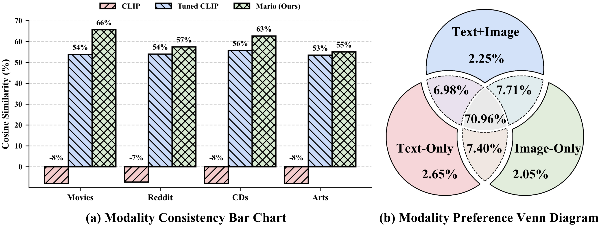
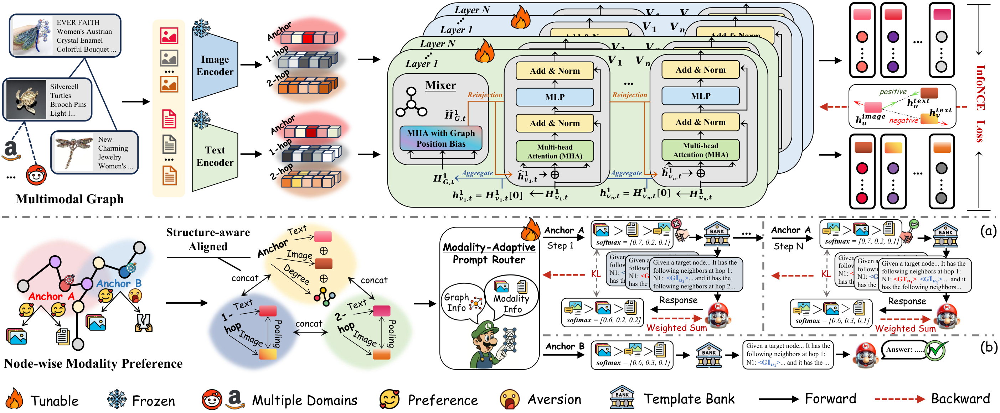
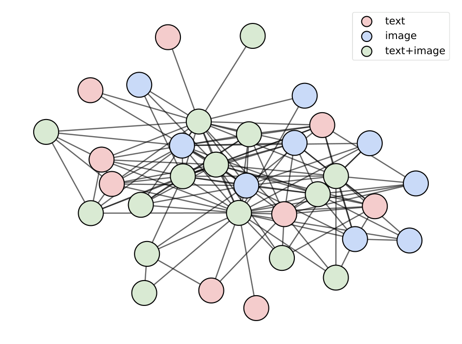
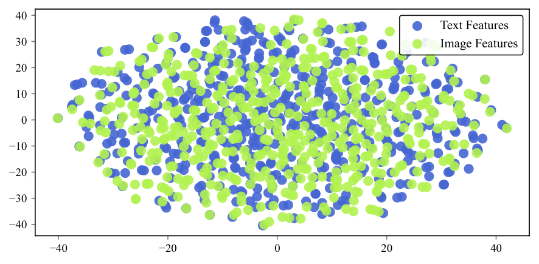
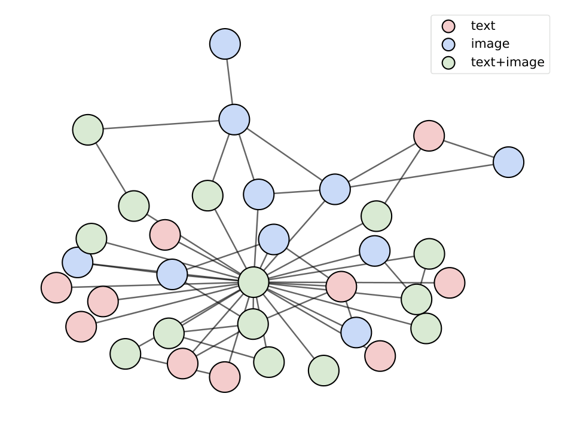

# Mario: Multimodal Graph Reasoning with Large Language Models

## TL;DR
这篇工作把多模态推理对象从孤立图文对换成带边结构的多模态图，并用可学习路由决定每个节点该看哪种模态组合。

## 中文摘要
论文针对多模态图推理，认为现有方法把图像文本对孤立编码，忽略了真实数据中的关系结构。Mario 分两步：先用图条件 VLM 在拓扑引导下做细粒度跨模态对齐，再把对齐后的特征组织成图感知指令视图，并通过可学习路由为每个节点和邻域选择最有信息量的模态配置交给 LLM。摘要称其在多个 MMG 基准上有效，但由于摘要截断，具体提升和适用边界摘要没有充分说明。

## Quick Facts
- Paper ID: `2603.05181v1`
- Authors: Yuanfu Sun, Kang Li, Pengkang Guo, Jiajin Liu, Qiaoyu Tan
- Domain: Multimodal
- Published: 2026-03-05T13:49:41Z
- arXiv: [abstract](https://arxiv.org/abs/2603.05181v1)
- PDF: [download](https://arxiv.org/pdf/2603.05181v1.pdf)
- Reading priority: high
- Why this priority: 与多模态和 LLM 主线高度契合，问题设置比普通图文任务更接近真实系统；但实验摘要不完整，需要带着证据意识去读。

## Research Background And Motivation
多模态推理近年多依赖 VLM 处理单个图文对，但真实世界数据常天然带有节点关系和图结构。若想让 LLM 在这类场景中推理，仅做孤立编码会丢失拓扑和邻域信息。

## Problem Framing
核心问题是如何在保留图拓扑的同时，把文本、图像和结构信号一起交给 LLM 做推理。难点在于跨模态一致性本来就弱，而且不同节点与邻域对模态的依赖并不相同。

## Approach Snapshot
Mario 采用两阶段设计：先用图条件 VLM 在拓扑引导下做细粒度跨模态对比学习，联合修正文图特征；再做模态自适应的图指令微调，把对齐后的特征组织成图感知指令视图，并用可学习路由选择最有信息量的模态配置供 LLM 推理。

## Evidence Mentioned In Abstract
摘要只说明在多个 MMG 基准上做了大规模实验，并声称 Mario 有效。由于摘要截断，具体对比对象、提升幅度、不同组件的消融结论和成本开销摘要没有充分说明。

## Research Or Engineering Value
如果成立，这项工作为“LLM 处理带图结构的多模态数据”提供了比简单拼接输入更系统的路线，可用于多模态知识图、文档图和复杂实体关系场景。它的模态路由思路也可能推广到更一般的异构输入选择问题。

## Reading Checklist
- 图条件 VLM 如何把边信息注入跨模态对齐，是否会放大错误边带来的噪声？
- 可学习路由选择模态配置的粒度是什么，是否对节点类型或邻域规模敏感？
- 所谓 diverse MMG benchmarks 包含哪些任务，收益主要来自图结构建模还是更强的特征对齐？

## Core Contributions
- 把多模态图推理中的两个核心障碍明确为跨模态一致性弱和模态偏好异质。
- 提出图条件 VLM，用拓扑引导的细粒度跨模态对比学习联合修正文图特征。
- 提出模态自适应图指令微调和可学习路由，让 LLM 按节点与邻域选择更合适的模态视图。

## Why Read It
- 它直接对应多模态 LLM 下一步常见痛点：输入不再是单轮图文，而是带关系结构的复杂对象。
- 方法里同时有表示学习和指令调优两层设计，值得看两者分工是否清晰。
- 如果你关心多模态 Agent 读图、读文档、看关系图，这篇论文的问题设置比普通 VLM 论文更接近真实系统。

## Risks Or Limits
- 摘要截断导致实验结论不完整，当前无法判断收益是否稳定。
- 方法链路较长，训练和推理成本可能不低，工程可复现性需要核对。

## Recommended For
- 做多模态 LLM 与图推理的研究者
- 关注文档图、知识图或复杂实体关系理解的工程师
- 想研究输入路由与异构模态选择机制的读者

## Keywords
- 多模态图推理
- 图条件 VLM
- 图指令微调
- 模态自适应路由
- LLM

## Figures

- Full asset manifest: [images/index.md](images/index.md)

## Abstract
Recent advances in large language models (LLMs) have opened new avenues for multimodal reasoning. Yet, most existing methods still rely on pretrained vision-language models (VLMs) to encode image-text pairs in isolation, ignoring the relational structure that real-world multimodal data naturally form. This motivates reasoning on multimodal graphs (MMGs), where each node has textual and visual attributes and edges provide structural cues. Enabling LLM-based reasoning on such heterogeneous multimodal signals while preserving graph topology introduces two key challenges: resolving weak cross-modal consistency and handling heterogeneous modality preference. To address this, we propose Mario, a unified framework that simultaneously resolves the two above challenges and enables effective LLM-based reasoning over MMGs. Mario consists of two innovative stages. Firstly, a graph-conditioned VLM design that jointly refines textual and visual features through fine-grained cross-modal contrastive learning guided by graph topology. Secondly, a modality-adaptive graph instruction tuning mechanism that organizes aligned multimodal features into graph-aware instruction views and employs a learnable router to surface, for each node and its neighborhood, the most informative modality configuration to the LLM. Extensive experiments across diverse MMG benchmarks demonstrate that Mario consistently outperforms state-of-the-art graph models in both supervised and zero-shot scenarios for node classification and link prediction. The code will be made available at https://github.com/sunyuanfu/Mario.

## Recommendation Signals
- Recommendation score: 8.81
- Relevance score: 2.47
- Recency score: 3.0
- Popularity score: 2.3
- Quality score: 2.3

## Assets
- Extracted assets are stored in the `images/` folder next to this page.
- Browse the image manifest here: [images/index.md](images/index.md)
