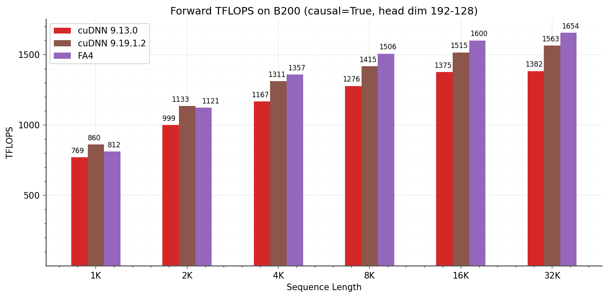
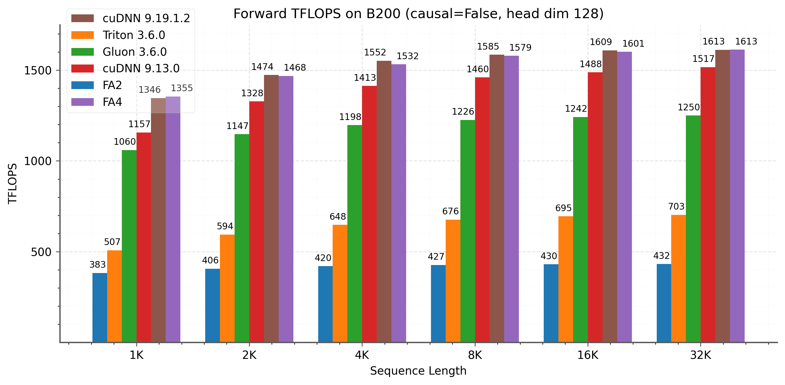
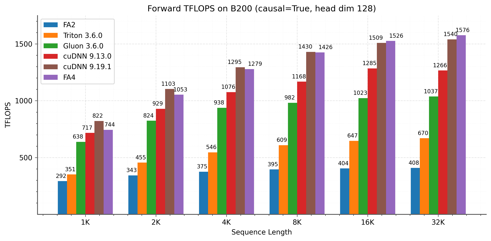
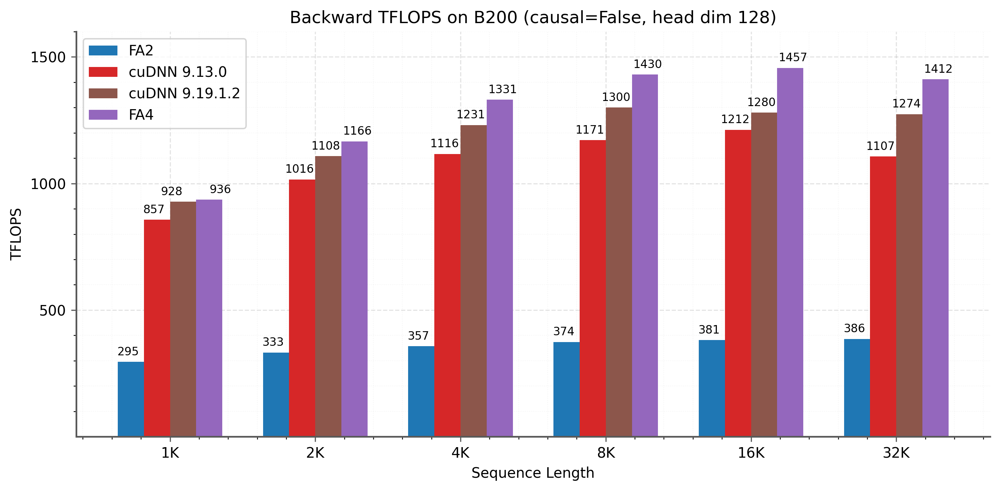
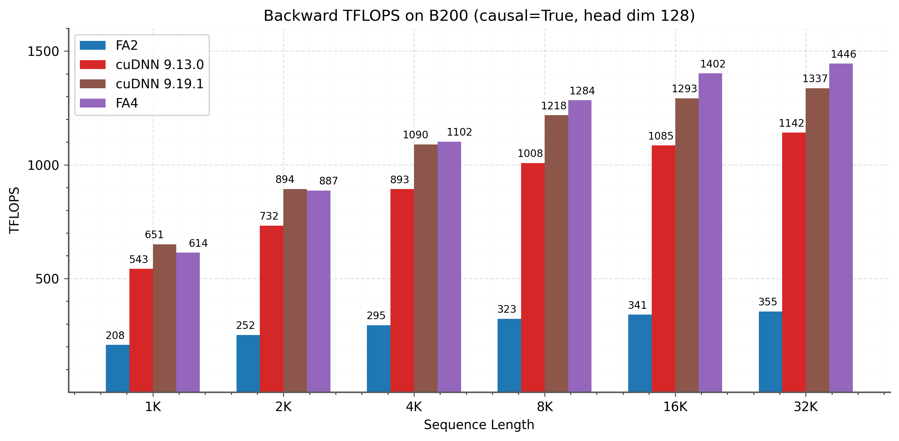
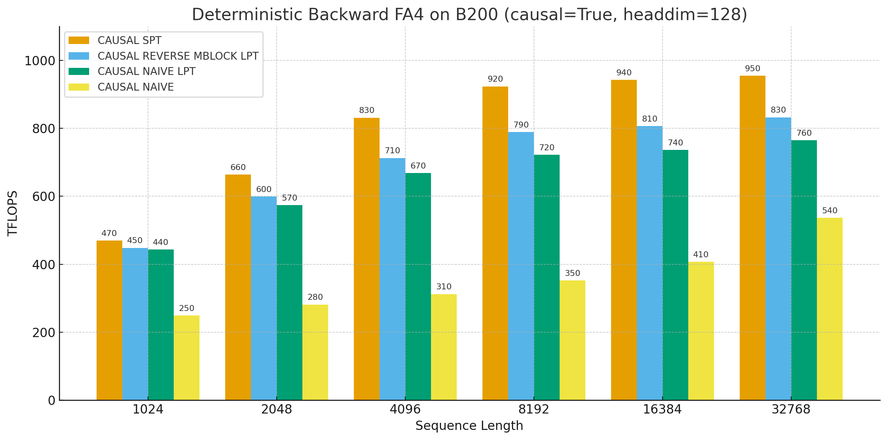
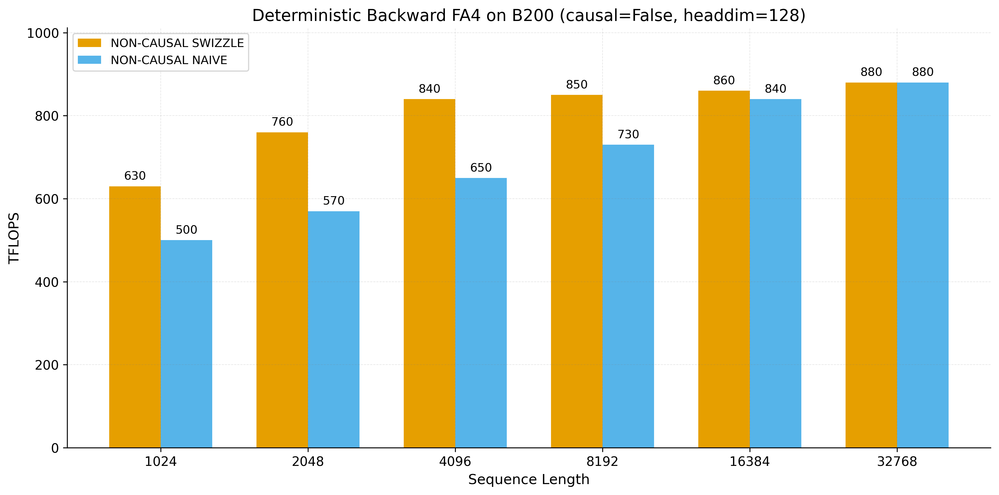

# FlashAttention-4: Algorithm and Kernel Pipelining Co-Design for Asymmetric Hardware Scaling

## TL;DR
这篇工作把注意力 kernel 的算法与流水线按 Blackwell 的非对称扩容重新协同设计，核心看点是把非 matmul 开销和 shared memory 流量一起压下去。

## 中文摘要
这篇工作针对 Blackwell GPU 上 tensor core 提升快于 shared memory 带宽和指数运算单元的非对称扩容，重新设计了 FlashAttention 的算法与 kernel 流水线。方法包括利用全异步 MMA 和更大 tile、用软件模拟指数与条件 softmax rescaling 降低非 matmul 操作，以及借助 tensor memory 和 2-CTA MMA 减少 backward 的 shared memory 流量与 atomic adds。摘要给出在 B200 BF16 上相对 cuDNN 9.13 最多 1.3 倍、相对 Triton 最多 2.7 倍的加速，并报告最高 1613 TFLOPs/s、71% 利用率；实现层面还声称用 Python 内嵌的 CuTe-DSL 在保持表达力的同时把编译时间降到传统 C++ 模板方案的 1/20 到 1/30。摘要没有充分说明这些收益覆盖哪些序列长度、批大小、前向/反向场景，以及与 H100/GB200 迁移相关的公平 baseline 细节。

## Quick Facts
- Paper ID: `2603.05451v1`
- Authors: Ted Zadouri, Markus Hoehnerbach, Jay Shah, Timmy Liu, Vijay Thakkar, Tri Dao
- Institutions: Princeton University, Colfax Research, NVIDIA
- Domain: LLM Inference Systems
- Venue / Journal: arXiv preprint
- Citations: Citation count unavailable
- Published: 2026-03-05T18:24:49Z
- Source page: [open](http://arxiv.org/abs/2603.05451v1)
- PDF: [download](https://arxiv.org/pdf/2603.05451v1)
- Reading priority: high
- Why this priority: 这篇工作与当前 LLM inference acceleration、低层 kernel 生成和 Blackwell 部署主线高度贴合，摘要还给出了明确的 B200 性能与利用率结果，以及编译器/DSL 维度的附加价值。优先级高，但阅读全文时应重点核对 baseline 公平性、硬件依赖和数值稳定性。

## Abstract Translation
Attention 是 Transformer 架构的核心层，也是大语言模型和长上下文应用的瓶颈。虽然 FlashAttention-3 通过异步执行和 warp specialization 为 Hopper GPU 优化了 attention，但它主要面向 H100。AI 产业已迅速转向部署 B200 和 GB200 等 Blackwell 系统；这类硬件存在明显的非对称扩容：tensor core 吞吐翻倍，而 shared memory 带宽、指数运算单元等扩得更慢甚至不变。为应对这些新瓶颈，本文提出了若干技术：(1) 利用完全异步 MMA 与更大 tile 重新设计流水线；(2) 通过软件模拟指数和条件式 softmax rescaling 减少非矩阵乘操作；(3) 利用 tensor memory 与 2-CTA MMA 模式降低反向传播中的 shared memory 流量和 atomic add。作者报告在 B200 上、BF16 条件下，相对 cuDNN 9.13 最多 1.3 倍、相对 Triton 最多 2.7 倍加速，最高达到 1613 TFLOPs/s（71% 利用率）。除算法外，FlashAttention-4 还完全用嵌入 Python 的 CuTe-DSL 实现，在保持完整表达力的同时，相比传统 C++ 模板方式取得 20 到 30 倍更快的编译时间。

## Research Background And Motivation
FlashAttention 系列已经把 attention 优化推进到强烈依赖 GPU 微架构的阶段；从 H100 到 Blackwell，继续沿用旧瓶颈假设会直接错失性能。本文关注的不是一般代码生成，而是 datacenter GPU 上 LLM attention 前后向 kernel 在 Blackwell 非对称扩容下的重新定标问题。

## Problem Framing
核心问题是：当 Blackwell 上 tensor core 吞吐增长快于 shared memory 带宽、MUFU exponential 吞吐和一般 ALU 时，attention kernel 的真实瓶颈已经从 matmul 转向 non-matmul 与片上数据搬运。论文试图回答如何同时改算法和 kernel pipeline，才能在不只是把 Hopper 代码移植过来的前提下，让 attention 在 B200/GB200 上重新接近硬件上限。

## Method Overview
论文采用算子级 algorithm-kernel co-design：以前向/反向 attention 的 roofline 为起点，把 Blackwell 的 fully asynchronous MMA、TMEM 和 2-CTA tensor core 视作新的主约束与主机会，然后分别从流水线重排、softmax 非 matmul 开销压缩、shared memory 流量削减以及调度/寄存器分配四个方向改写 FlashAttention 内核。实现层面则用 CuTe-DSL 代替以往重模板 C++，把低层控制保留下来。

### Method Figure


## Method Details
- 前向和反向都围绕 Blackwell 的 fully asynchronous MMA 与更大 tile 重新设计 software pipeline，使 tensor core、softmax 与 memory 操作更充分重叠。
- 前向用基于 FMA 单元多项式近似的软件模拟 exponential，绕开 MUFU exponential 吞吐不随 tensor core 一起增长的瓶颈。
- softmax 中加入 conditional rescaling，只在必要时执行 rescaling，以减少 non-matmul 指令与同步负担。
- 反向利用 TMEM 保存更多 tensor core 中间结果，减少 shared memory 读写；再用 2-CTA MMA 让 CTA 对分担 B operand 的 staging 和 loading，进一步降低 SMEM 流量。
- 2-CTA 设计还被用于重构 dQ 计算，将全局 atomic reduction 数量减半；另外提供 deterministic backward，并通过 swizzling、LPT/SPT 调度和资源分配把其开销压低。

## Experimental Setup And Evidence
实验主体是单 GPU attention kernel benchmark。主文、摘要和图注反复写 B200 GPU；但附加实验说明又写“B100 180GB SXM6 (1000W)”，提取文本在硬件型号上存在不一致。明确给出的设置包括：BF16/FP16 attention，序列长度 1k 到 32k，总 token 数固定为 32k；hidden dimension 2048；head dimension 为 64、128，以及用于 DeepSeek V3 风格的 (192,128)；同时覆盖 causal / non-causal、forward / backward。计时流程是 warmup 5 次、重复 10 次取平均；软件版本包括 CUDA 13.1、Triton 3.6、PyTorch 2.10.0、CuTe-DSL 4.4.1，以及 cuDNN 9.13 和 9.19.1.2。

### Experiment Figure


*Figure cue:* Forward pass TFLOPS comparison between cuDNN and FA4 on B200 (FP16/BF16) with head dimension (192, 128) for causal attention (typically used in DeepSeek V3 architecture)

## Key Tables

### Table 1
*Table cue:* Compile time for a single kernel: FA3 (C++ templates) and FA4 (CuTe-DSL). Typically FA2 and FA3 require precompiling hundreds of kernels for different attention variants.

```text
Method | Forward pass | Backward pass
55s | 45s
2.5s | 1.4s
Speedup | 22 | 32
```

## Datasets And Benchmarks
- Blackwell 上的 attention kernel 基准：BF16/FP16，sequence length 1k, 2k, ..., 32k，总 token 数固定 32k
- Head dimension 64、128，以及 query/key-value 维度 (192,128) 的因果 attention 配置
- Forward pass 与 backward pass，分别评测 causal / non-causal
- 单 kernel 编译时间对比：FA3 的 C++ templates vs FA4 的 CuTe-DSL

## Baselines
- PyTorch 标准 attention 实现
- Triton attention 实现（文中说明使用 B200-specific instructions）
- Gluon 实现
- cuDNN 9.13.0
- cuDNN 9.19.1.2（附加实验说明提到）
- FA3 的 C++ template 实现（用于编译时间对比）

## Metrics
- Kernel runtime / 执行时间
- TFLOPs/s
- 相对 cuDNN 与 Triton 的 speedup
- 相对理论峰值的利用率
- 单 kernel 编译时间
- deterministic backward 相对 nondeterministic backward 的速度比例

## Ablations And Analysis
- Roofline 分析指出：在典型 Blackwell attention 工作负载上，shared memory traffic 与 exponential operations 的时间占比可比 MMA compute 高 25% 到 60%。
- Forward 结果按 sequence length、head dimension、causal / non-causal 展示；文中称因果场景收益更大，原因归于 LPT scheduler。
- Backward 结果强调 2-CTA backward 的长序列收益。
- Deterministic backward 消融比较了 SPT、LPT with reverse mblock order、LPT，以及无 batch/head swizzle 的 naive 调度。

## Evaluation Validity And Fairness
- 优点：评测维度较系统，覆盖前向/反向、causal / non-causal、多个 head dimension 与 1k-32k 序列长度。
- 优点：同时给出开源实现、厂商库和编译时间对比，而不只报单一 baseline。
- 风险：提取文本在实验硬件上出现 B200 与 B100 180GB SXM6 的不一致，这会影响结果可解释性。
- 风险：实验几乎都停留在单算子 kernel 级别，提取文本没有充分说明端到端 LLM serving 或训练吞吐、延迟收益。

## Main Results And Claims
提取文本支持的主要结论是：在文中给定的 Blackwell attention benchmark 上，FA4 前向在 head dimension 128 的设置下相对 cuDNN 9.13.0 达到 1.1-1.3 倍、相对 Triton 达到 2.1-2.7 倍 speedup；摘要与正文还给出总体“最高 1.3 倍 over cuDNN、2.7 倍 over Triton”的表述。作者报告最高达到 1613 TFLOPs/s，约为 B200 理论峰值的 71%。正文称中长序列（4k 及以上）前向 consistently 超过各 baseline，反向在长序列和 causal masking 下也有稳定收益；deterministic backward 最高可达到 nondeterministic 1-CTA backward 约 75% 的速度。编译时间表显示，单 kernel 编译从前向 55s / 反向 45s 降到 2.5s / 1.4s，对应约 22 倍 / 32 倍加速。

## Research Or Engineering Value
对做 Blackwell LLM attention 内核、训练栈或 serving 底层优化的人，这篇论文的工程价值很直接：它给出了下一代 GPU 上 dense attention 不该再把 matmul 当唯一主瓶颈的设计信号，也给出 TMEM、2-CTA、software exp 这类可落地抓手。对更广泛的系统社区，它的可迁移价值主要体现在“当 compute 扩得比 non-matmul 单元更快时，该如何重新写 kernel pipeline”的方法论，而不是具体实现可无修改跨代复用。

## Relation To Prior Work
相对常见路线，这篇工作的差异不是继续围绕 HBM I/O 或 occupancy 做通用优化，也不是走量化或稀疏化来减少算量。与早期 FlashAttention 主要通过 tiling 与 fusion 降低 global memory 访问、与 FlashAttention-2 主要改并行化、与 FlashAttention-3 主要适配 Hopper 异步执行不同，FA4 把 Blackwell 上真正变慢的部分重新定位为 exponential 单元和 shared memory，而后用 software exp、conditional rescaling、TMEM 与 2-CTA 来压 non-MMA 开销和片上流量。相对通用库或编译器自动生成路线，它更像是明确利用 Blackwell 特有执行模型的架构专用内核。

## Overall Assessment
这是一篇很像 systems reading group 会优先细读的 Blackwell attention kernel 论文：最值得信的是它对瓶颈迁移的 framing，以及围绕 TMEM、fully asynchronous MMA、2-CTA 和 software exp 展开的算子级协同设计，因为这些点与提取文本中的硬件描述、roofline 分析和 kernel TFLOPs 结果是相互一致的。最该怀疑的地方则是结论的外推范围和实验公平性：提取文本显示结果主要来自单算子 benchmark，硬件型号存在不一致，baseline 版本又快速追平，且数值稳定性与端到端收益没有被充分交代。因此，它很可能是 Blackwell dense attention 设计规则的重要参考，但还不足以单凭现有提取文本就下“广泛部署上明显优于现有库”的结论。

## Technical Route Positioning
这篇论文属于 LLM systems 中的算子级 GPU kernel co-design 路线，具体落在 dense attention 前后向内核的微架构适配与流水线重排，而不是模型压缩、稀疏化或 serving 调度。它解决的是从 attention 数学形式到 PTX/SASS 级执行之间那一段“如何把 Blackwell 新硬件特性真正转成吞吐”的问题，位置大致在 compiler/runtime 与手写 kernel 之间。

## Scorecard
- Overall: 7.4/10
- Innovation: 8/10
- Technical Quality: 8/10
- Experimental Rigor: 6/10
- Writing Clarity: 7/10
- Practical Value: 8/10

## Related Paper Comparisons
- [SlideSparse: Fast and Flexible (2N-2):2N Structured Sparsity](/papers/2603-05232v1-slidesparse-fast-and-flexible-2n-2-2n-structured/) (同属 LLM inference efficiency，但优化对象不同): 根据给定摘要，SlideSparse 通过把更温和的结构化稀疏模式重写到现有 Sparse Tensor Core 上，主要在 matmul 侧减少有效计算量，并已集成到 vLLM；FA4 则默认 dense attention，不改模型稀疏结构，而是针对 Blackwell 上 non-matmul 与 shared memory 瓶颈做 kernel/pipeline 重构。两者处在同一系统栈但针对不同瓶颈：前者是稀疏执行映射，后者是 dense attention 内核协同设计。
- [GPTQ: Accurate Post-Training Quantization for Generative Pre-trained Transformers](/papers/2210-17323-gptq-accurate-post-training-quantization-for-gen/) (同属推理提速路线，但层级不同): 根据给定摘要，GPTQ 通过后训练量化在模型表示层面降低推理成本，核心风险在精度保持；FA4 不改变模型权重格式，主要保留 BF16/FP16 attention 路径并在 GPU 内核层面挖掘 Blackwell 的 TMEM、2-CTA 与异步 MMA。前者更接近模型压缩和部署优化，后者更接近算子级微架构适配，两者可以互补但不可直接替代。

## Strengths
- 问题设定非常贴近当前 Blackwell datacenter GPU 上的 LLM attention 主线，明确抓住了 tensor core 与 non-matmul 单元扩容不对称这一系统事实。
- 性能来源分解较具体，不是泛泛地说更快，重点落在 exponential 单元、shared memory traffic、TMEM、2-CTA 和 atomic reduction。
- 同时覆盖 forward、backward 和 deterministic backward，而不是只优化单一路径。
- 把 kernel 设计与实现框架一起考虑，CuTe-DSL 的编译时间改进对研究迭代和工程维护都有现实价值。

## Future Work
- 补齐软件模拟 exponential 与 conditional rescaling 的数值误差、稳定性和训练收敛验证。
- 在 GB200、其他 Blackwell SKU 以及后续 GPU 上验证这些设计点的稳定性与可迁移性。
- 把 kernel 级收益扩展到端到端 LLM serving 或 training 基准，说明对 token latency、throughput 和内存占用的实际影响。
- 系统比较与更新版 cuDNN、Triton 的公平 baseline，并明确哪些收益仍然只能通过专用 kernel 获得。

## Reading Checklist
- 先核对实验硬件到底是 B200 还是 B100 180GB SXM6，以及不同图表是否混用了平台。
- 重点看 software-emulated exponential 的实现：多项式近似阶数、指令开销、误差控制和何时优于 MUFU。
- 重点看 conditional softmax rescaling 的触发条件与数值安全边界。
- 确认 TMEM 和 2-CTA 在 backward 中分别减少了多少 SMEM 访问和 atomic adds，以及这些收益是否只在长序列显著。

## Core Contributions
- 针对 Blackwell 非对称硬件扩容，重新定义 FlashAttention 的 pipeline 设计点，而不是沿用 H100 时代的瓶颈假设。
- 提出通过软件模拟 exponential 和条件 softmax rescaling 压低 non-matmul 开销，并结合更大 tile 与全异步 MMA 重排执行流水。
- 在 backward 路径中利用 tensor memory 和 2-CTA MMA 降低 shared memory traffic 与 atomic adds，并用 CuTe-DSL 给出可表达且编译更快的实现。

## Why Read It
- 这是少数直接面向 Blackwell/B200 attention kernel 的系统论文，和当前 LLM inference acceleration 主线高度一致。
- 摘要把性能来源明确指向 non-matmul 操作、shared memory 流量和 backward 原子开销，而不只是泛泛地说“更快”。
- 如果你在评估 CuTe-DSL 是否能替代重模板 C++ kernel 开发，这篇提供了一个高价值案例。

## Risks Or Limits
- 硬件依赖极强，方法高度绑定 Blackwell 的 TMEM、fully asynchronous MMA 和 2-CTA 模式。
- 提取文本没有充分说明数值正确性验证，尤其是软件模拟 exponential 与条件 rescaling 的精度和稳定性。
- headline speedup 对 baseline 版本敏感；图注已说明较新的 cuDNN 与 FA4 性能接近。
- 实验证据主要是 kernel microbenchmark，提取文本没有充分说明在完整 LLM inference / training stack 中的端到端收益。

## Recommended For
- 做 LLM inference kernel 与 serving 优化的研究者和工程师
- 研究 GPU kernel、编译器与 runtime 协同设计的人
- 关注 Hopper 到 Blackwell 跨代迁移与硬件瓶颈变化的人

## Keywords
- FlashAttention
- Blackwell GPU
- B200
- attention kernel
- kernel pipelining
- asymmetric hardware scaling

## Additional Figures



*Figure cue:* Forward pass TFLOPS on B200 (FP16/BF16) with head dimension 128. Left: non-causal attention. Right: causal attention. FA4 achieves 1.1-1.3 speedup over cuDNN 9.13.0 and 2.1-2.7 over Triton across sequence lengths. Since the initial release of our implementation, newer versions of cuDNN have incorporated many of the techniques described in this paper, yielding similar performance to FA4.



*Figure cue:* Forward pass TFLOPS on B200 (FP16/BF16) with head dimension 128. Left: non-causal attention. Right: causal attention. FA4 achieves 1.1-1.3 speedup over cuDNN 9.13.0 and 2.1-2.7 over Triton across sequence lengths. Since the initial release of our implementation, newer versions of cuDNN have incorporated many of the techniques described in this paper, yielding similar performance to FA4.



*Figure cue:* Backward pass TFLOPS on B200 (FP16/BF16) with head dimension 128. Left: non-causal attention. Right: causal attention.



*Figure cue:* Backward pass TFLOPS on B200 (FP16/BF16) with head dimension 128. Left: non-causal attention. Right: causal attention.



*Figure cue:* Ablations for Deterministic Backward pass on B200 (FP16/BF16) with head dimension 128. Causal attention -- SPT, LPT with reverse mblock order, LPT, and naive with no batch/head swizzle.



*Figure cue:* Ablations for Deterministic Backward pass on B200 with head dimension 128. Non-causal attention with batch/head swizzle versus naive. Right: causal attention -- SPT, LPT with reverse mblock order, LPT, and naive with no batch/head swizzle.


- Full asset manifest: [images/index.md](images/index.md)

## Abstract
Attention, as a core layer of the ubiquitous Transformer architecture, is the bottleneck for large language models and long-context applications. While FlashAttention-3 optimized attention for Hopper GPUs through asynchronous execution and warp specialization, it primarily targets the H100 architecture. The AI industry has rapidly transitioned to deploying Blackwell-based systems such as the B200 and GB200, which exhibit fundamentally different performance characteristics due to asymmetric hardware scaling: tensor core throughput doubles while other functional units (shared memory bandwidth, exponential units) scale more slowly or remain unchanged. We develop several techniques to address these shifting bottlenecks on Blackwell GPUs: (1) redesigned pipelines that exploit fully asynchronous MMA operations and larger tile sizes, (2) software-emulated exponential and conditional softmax rescaling that reduces non-matmul operations, and (3) leveraging tensor memory and the 2-CTA MMA mode to reduce shared memory traffic and atomic adds in the backward pass. We demonstrate that our method, FlashAttention-4, achieves up to 1.3$\times$ speedup over cuDNN 9.13 and 2.7$\times$ over Triton on B200 GPUs with BF16, reaching up to 1613 TFLOPs/s (71% utilization). Beyond algorithmic innovations, we implement FlashAttention-4 entirely in CuTe-DSL embedded in Python, achieving 20-30$\times$ faster compile times compared to traditional C++ template-based approaches while maintaining full expressivity.

## Recommendation Signals
- Recommendation score: 9.38
- Relevance score: 3.0
- Recency score: 3.0
- Popularity score: 1.3
- Quality score: 1.3
- Analysis candidate score: 10.0
- Analysis priority rank: 1
- Analysis signals: flashattention, kernel pipelining, h100, b200, throughput, memory, bandwidth, speedup

## Assets
- Extracted assets are stored in the `images/` folder next to this page.
- Browse the image manifest here: [images/index.md](images/index.md)
