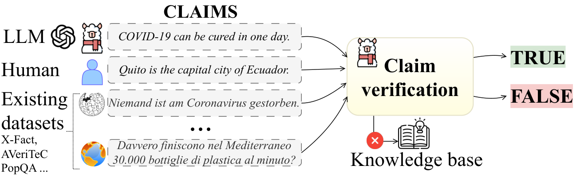
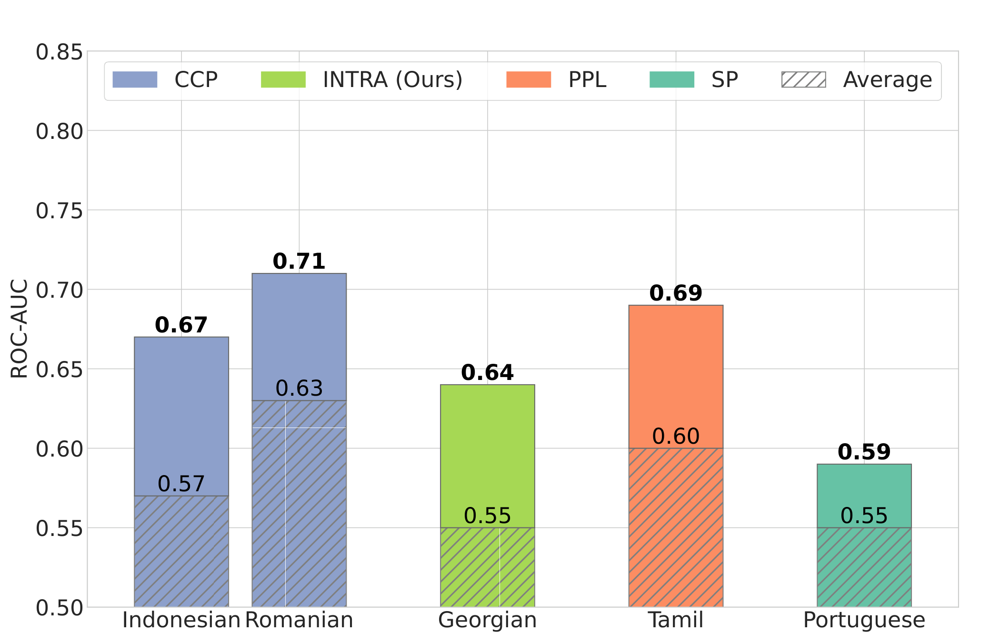
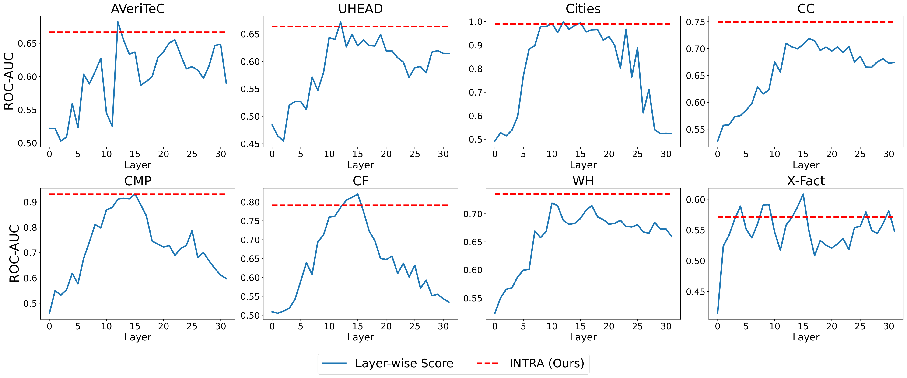
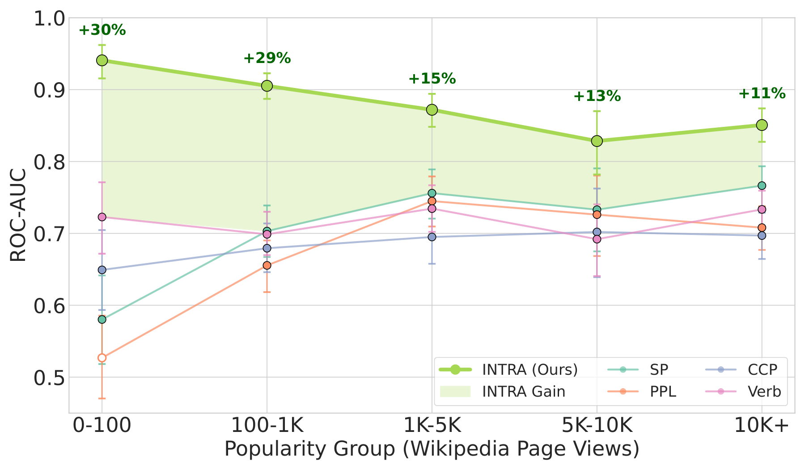
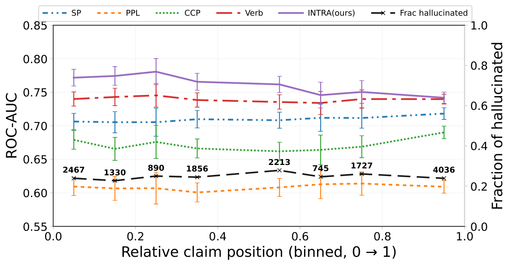
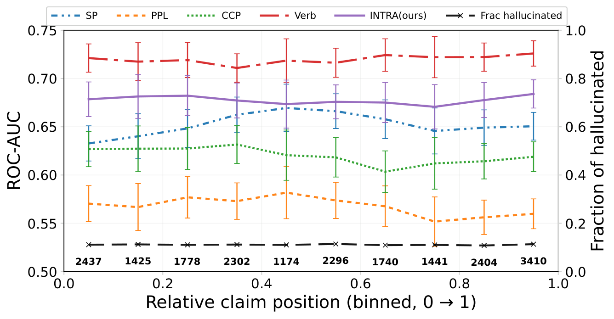

# Leveraging LLM Parametric Knowledge for Fact Checking without Retrieval

## TL;DR
这篇论文值得读的关键不在于又做了一个核查器，而在于它把“LLM 的参数知识能否独立承担事实核查”从检索范式中单独拉出来，并给出了一条偏内部表征的路线。

## 中文摘要
这篇工作将事实核查从常见的“检索外部证据再验证”流程中拆出，主张直接利用 LLM 的参数知识判断任意自然语言断言。作者围绕无检索事实核查建立了一个强调泛化能力的评测框架，覆盖长尾知识、断言来源变化、多语言和长文本生成四类挑战，并在 9 个数据集、18 种方法、3 个模型上比较不同路线。摘要声称基于 logit 的方法通常不如利用内部表征的方法，且提出的 INTRA 通过建模内部表征交互取得了当前最佳表现和较强泛化。摘要没有充分说明具体增益幅度、计算代价、失败案例以及与检索式方案的直接取舍。

## Quick Facts
- Paper ID: `2603.05471v1`
- Authors: Artem Vazhentsev, Maria Marina, Daniil Moskovskiy, Sergey Pletenev, Mikhail Seleznyov, Mikhail Salnikov, Elena Tutubalina, Vasily Konovalov, Irina Nikishina, Alexander Panchenko, Viktor Moskvoretskii
- Domain: Large Language Models
- Published: 2026-03-05T18:42:51Z
- arXiv: [abstract](https://arxiv.org/abs/2603.05471v1)
- PDF: [download](https://arxiv.org/pdf/2603.05471v1.pdf)
- Reading priority: high
- Why this priority: 优先级高：主题直接落在 LLM 可信性与 Agent 可靠性这一当前主线，且论文不只提出方法，还重新定义了“无检索事实核查”问题并给出较系统的评测。结合推荐分数 8.73 和领域高优先级，这篇论文值得尽早阅读；但在接受其结论前，需要重点核对时效性边界、成本以及与检索式方案的互补关系。

## Abstract Translation
可信性是构建在大语言模型（LLM）之上的 Agent 系统的核心研究挑战。为了提升可信性，来自人工文本、网页内容和模型输出的自然语言断言，通常通过检索外部知识，再由 LLM 判断断言是否忠实于检索到的证据来做事实核查。因此，这类方法受到检索错误和外部数据可用性的限制，同时也没有充分利用模型自身的事实验证能力。本文提出“无检索事实核查”任务，关注在不依赖外部检索的前提下验证任意自然语言断言，并构建了一个强调泛化能力的综合评测框架，考察其在长尾知识、断言来源变化、多语言和长文本生成上的鲁棒性。在 9 个数据集、18 种方法和 3 个模型上的实验表明，基于 logit 的方法通常不如利用内部表征的方法。基于这一发现，作者提出 INTRA，通过建模内部表征之间的交互取得了当前最优表现和较强泛化。更广泛地说，这项工作将无检索事实核查确立为一个有前景的研究方向，可与检索式框架互补、提升可扩展性，并支持把这类系统作为训练奖励信号或生成过程中的组成模块。

## Research Background And Motivation
在 LLM Agent 场景里，事实性判断正在从“生成后做检索核对”扩展到“模型自身能否先做真假判断”。现有检索式事实核查虽然常用，但会受检索质量、知识库覆盖和时延约束，因此有必要单独研究参数知识能否承担 claim-level 事实判断。

## Problem Framing
论文要解决的是：当输入只是一个任意来源的原子化自然语言断言时，能否不依赖外部证据、原始提示词或完整生成过程，只凭模型参数知识与内部信号判断其真假。这个问题重要，因为它对应事实核查链路里最基础的 verifier 环节，若能成立，就能减少对检索系统的依赖，并更直接评估 LLM 内生事实能力的上限与边界。

## Method Overview
作者先把“无检索事实核查”明确成一个独立任务，并围绕泛化而非单一基准最优构建评测框架。方法上，论文系统比较了概率/logit 路线、内部表征探针路线、注意力相关路线和 verbalized 判断路线，随后提出 INTRA。INTRA 的核心做法是：先在每一层把 token 级 hidden states 聚合成序列表征，再对各层分别输出 truthfulness score，最后只融合中间层的层级分数，并在融合前做分位数归一化。整个系统只看 claim 文本，不需要外部检索，也不要求访问生成该 claim 的 prompt 或完整输出。

### Method Figure

*Figure cue:* The task setting of fact-checking without retrieval. Claims from any source (human or LLMs) can be verified without having access to a knowledge base.

## Method Details
- 把任务定义为对任意来源的 atomic claim 输出真值分数，而且该分数只能由 claim 文本本身决定；不允许使用上下文、原始提示词、完整生成或任何外部知识。
- 对每一层，INTRA 不只取单个 token 或单层固定向量，而是对该层全部 token 的 hidden states 施加可学习权重，经 softmax 归一化后汇聚成 sequence-level embedding。
- 在每个层级 embedding 之上训练轻量线性分类器，得到该层的 truthfulness probability，并使用标准 cross-entropy 训练，以保持结构简单、降低对特定模式过拟合的风险。
- 跨层融合时只使用中间层而非首尾层，并在回归融合前对各层概率做 quantile normalization，以缓解不同层分数尺度不一致的问题。

## Experimental Setup And Evidence
论文在 9 个数据集、18 种方法、3 个模型上评测无检索 claim verification，报告 ROC-AUC 和 PR-AUC。评测维度覆盖长尾知识、人工与模型生成 claim 的来源变化、多语言、长文本生成以及 cross-model claims；其中 PopQA 被当作 in-domain 训练来源，其余数据集用于 out-of-domain 泛化评估。数据集构成上，提取文本明确提到 AC-PopQA、AC-WH、AVeriTeC、X-Fact、Cities、Companies、CounterFact、UHead、Common Claims 等来源；模型侧明确出现 Llama 3.1、Ministral、Phi-4，且 UHead 仅有适用于 Llama 3.1 的公开 checkpoint。具体数据规模、完整超参数、统计显著性和所有数据清洗细节，提取文本没有充分说明。

### Experiment Figure

*Figure cue:* ROC-AUC on PopQA, split into five popularity groups. The green arrow shows the percent improvement of the top method (INTRA) over the runner-up.

## Main Results And Claims
实验表明，监督式内部表征方法整体明显强于无监督的无检索方法以及检索式基线；同时，除 SP 外，多数基于 logit/uncertainty 的方法表现偏弱。INTRA 取得最高平均表现：在 Llama 3.1 上，其最高 ROC-AUC 比第二名 Sheeps 高 0.5%，跨数据集平均 ROC-AUC 高 2.7%；跨全部模型的平均提升为 1.3%。与 Verb+RAG 相比，INTRA 在 ROC-AUC 上基本持平，但平均 PR-AUC 高 3%，计算时间约少 20 倍。Verbalized 方法是最强无监督路线之一，但计算开销高，而且在非英语输入上拒答率最高可达 58%。论文还指出，一些规则生成数据集可能已出现饱和或污染，这会影响部分基准结果的解释。

## Research Or Engineering Value
如果你在做 Agent guardrail、事实性 reward model 或低时延自检模块，这篇论文的实际价值很明确：它给出了一条不依赖外部检索的 claim verifier 路线，而且相对 Verb+RAG 展示出更好的速度-性能折中。它尤其适合检索不可用、成本敏感或希望把 truthfulness signal 直接接入训练/生成过程的场景；但在必须提供外部证据链的产品流程里，它更像补充层，不像最终裁决器。

## Relation To Prior Work
相对主流的 RAG 事实核查，这篇论文把目标从“是否忠实于已检索证据”改成“claim 本身是否为真”，因此直接绕开了检索误差、知识库覆盖和额外时延。相对常见 uncertainty estimation，它不是只估计模型对自己生成内容的置信度，而是要求对任意来源的 claim 做真值判断；论文的实验也表明，hidden-state/internal-representation 路线通常比单纯 logit 信号更可靠。相对早期只抓某一层、某个 token，或依赖 prompt/完整生成过程的检测器，INTRA 的差异在于用 token 级表示汇聚形成层内判断，再用中间层的标准化分数做跨层融合，重点是提升跨数据集、跨来源、跨语言的泛化，而不是针对单一生成场景做特化。

## Overall Assessment
这篇论文最值得信的地方，是它把“无检索事实核查”作为独立问题正式化，并用较大范围的比较给出一个相当清晰的经验结论：在任意 claim 的真假判断上，内部表征通常比简单的 logit/uncertainty 信号更有价值，INTRA 也确实体现出较好的平均表现与效率。最该怀疑的地方不在任务设定本身，而在边界条件：无检索方法对知识过时、争议事实、证据可追溯性和模型可访问性的适应性仍不清楚，而且论文自己也指出部分 benchmark 可能已被污染或做得过熟。因此，这更像是一篇把“参数知识可否承担 verifier 职责”讲明白并推前一步的论文，而不是已经证明可以全面替代检索式事实核查的终局方案。

## Technical Route Positioning
这篇论文属于 LLM 真实性评估/幻觉检测中的“参数知识内省”路线，关注的是 claim-level verifier，而不是检索器或生成器本身。它试图在事实核查链路中，用模型内部表征直接估计断言真假，替代或补充传统“先检索证据，再判定是否忠实”的环节。

## Scorecard
- Overall: 7.2/10
- Innovation: 7/10
- Technical Quality: 7/10
- Experimental Rigor: 7/10
- Writing Clarity: 7/10
- Practical Value: 8/10

## Strengths
- 问题定义很清楚：把“对检索证据是否忠实”和“claim 本身是否为真”明确拆开，单独研究后者。
- 评测覆盖面较大，不只报一个新方法，而是在 9 个数据集、18 种方法、3 个模型上比较不同技术路线。
- INTRA 的结构相对克制，核心依赖 hidden states 的层内聚合与跨层融合，而不是高度特化的复杂头部设计。
- 结果同时给出性能与效率信号：相对 Verb+RAG，INTRA 保持竞争力的同时显著更快，说明这条路线有现实工程吸引力。

## Future Work
- 围绕中间层做更系统的特征学习与训练目标设计，验证“中间层最有信息量”的结论是否稳定。
- 把 claim 在长文本中的位置、生成长度等结构特征纳入 detector，增强对长文本生成错误的识别。
- 按语言、知识稀有度或 claim 来源做 detector routing，而不是假设单一检测器在所有条件下都最优。
- 专门评测知识时效性、争议事实和证据可追溯性要求高的场景，明确无检索路线的失效边界。

## Reading Checklist
- 先核对 INTRA 的两级结构：层内 token 汇聚怎么做、跨层回归如何训练、为什么只用中间层。
- 重点看 9 个数据集分别对应哪些泛化维度，尤其是人工 claim、模型生成 claim、长尾知识和长文本生成之间的差异。
- 检查 INTRA 的优势是否在多语言、长尾和 long-form setting 都稳定成立，而不只是集中在 PopQA 或少数数据集。
- 留意 Verb 和 Verb+RAG 的计算代价与非英语拒答问题，判断这些比较在工程上是否公平可比。

## Core Contributions
- 提出“无检索事实核查”任务，将断言真假判断与外部证据检索明确解耦。
- 构建以泛化为核心的评测框架，显式覆盖长尾知识、断言来源变化、多语言和长文本生成四类挑战。
- 在 9 个数据集、18 种方法、3 个模型上的比较中，总结出基于 logit 的路线通常不如利用内部表征的路线。

## Why Read It
- 它直接挑战了“事实核查必须先检索”的默认假设，对 LLM 可信性与 Agent 可靠性研究有方法论意义。
- 摘要显示这不是只报一个新模型，而是在较大范围内系统比较了无检索事实核查的可行路线。
- 如果你关注模型内省、参数知识利用或低依赖外部工具的 Agent 设计，这篇论文可能提供可迁移的思路。

## Risks Or Limits
- 无检索路线天然受参数知识时效性和覆盖范围限制；面对新近事实、争议性断言和必须提供可追溯证据的任务，提取文本没有充分说明。
- INTRA 依赖访问中间层 hidden states 和层级输出，这对闭源模型或受限推理接口并不总是可行。
- 监督训练以 PopQA 为 in-domain，尽管论文强调 OOD 泛化，但训练分布与测试分布之间的依赖关系仍值得警惕。
- 作者自己指出部分规则生成 benchmark 可能存在污染或饱和，这意味着某些方法优劣差异可能部分来自数据历史，而不完全是方法本身。

## Recommended For
- 关注 LLM 可信性、事实核查与幻觉缓解的研究者
- 在做 Agent 评测、守护栏或自检模块的工程师
- 研究模型内部表征、参数知识利用与无检索方法的读者

## Keywords
- 大语言模型
- 事实核查
- 无检索验证
- 参数知识
- 内部表征
- INTRA

## Additional Figures

*Figure cue:* ROC-AUC performance of individual layers in the INTRA method.

*Figure cue:* ROC-AUC on PopQA, split into five popularity groups. The green arrow shows the percent improvement of the top method (INTRA) over the runner-up.

*Figure cue:* Short-length claims.

*Figure cue:* Short-length claims.
- Full asset manifest: [images/index.md](images/index.md)

## Abstract
Trustworthiness is a core research challenge for agentic AI systems built on Large Language Models (LLMs). To enhance trust, natural language claims from diverse sources, including human-written text, web content, and model outputs, are commonly checked for factuality by retrieving external knowledge and using an LLM to verify the faithfulness of claims to the retrieved evidence. As a result, such methods are constrained by retrieval errors and external data availability, while leaving the models intrinsic fact-verification capabilities largely unused. We propose the task of fact-checking without retrieval, focusing on the verification of arbitrary natural language claims, independent of their source. To study this setting, we introduce a comprehensive evaluation framework focused on generalization, testing robustness to (i) long-tail knowledge, (ii) variation in claim sources, (iii) multilinguality, and (iv) long-form generation. Across 9 datasets, 18 methods and 3 models, our experiments indicate that logit-based approaches often underperform compared to those that leverage internal model representations. Building on this finding, we introduce INTRA, a method that exploits interactions between internal representations and achieves state-of-the-art performance with strong generalization. More broadly, our work establishes fact-checking without retrieval as a promising research direction that can complement retrieval-based frameworks, improve scalability, and enable the use of such systems as reward signals during training or as components integrated into the generation process.

## Recommendation Signals
- Recommendation score: 8.73
- Relevance score: 2.6
- Recency score: 3.0
- Popularity score: 2.0
- Quality score: 2.0

## Assets
- Extracted assets are stored in the `images/` folder next to this page.
- Browse the image manifest here: [images/index.md](images/index.md)
