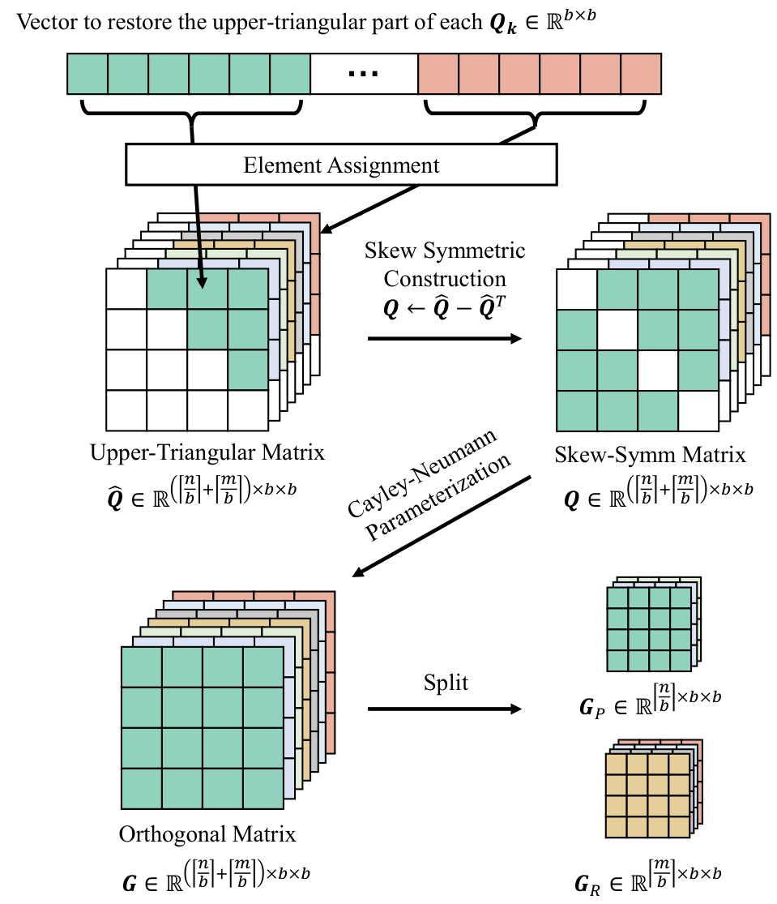
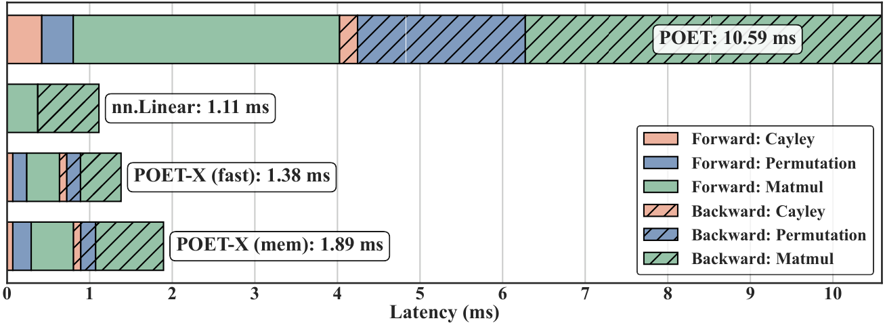
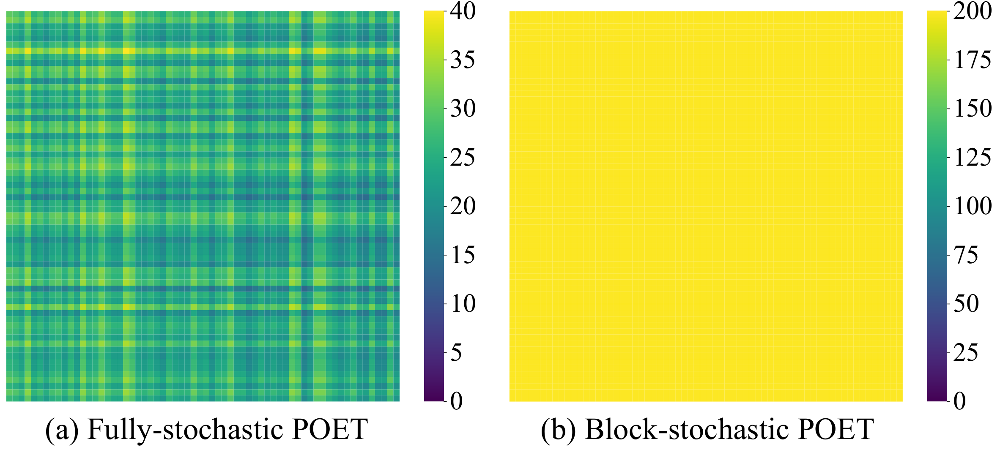
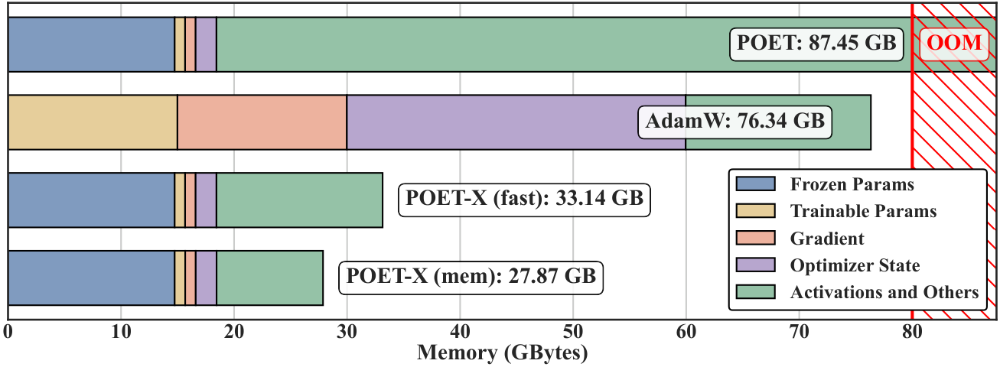
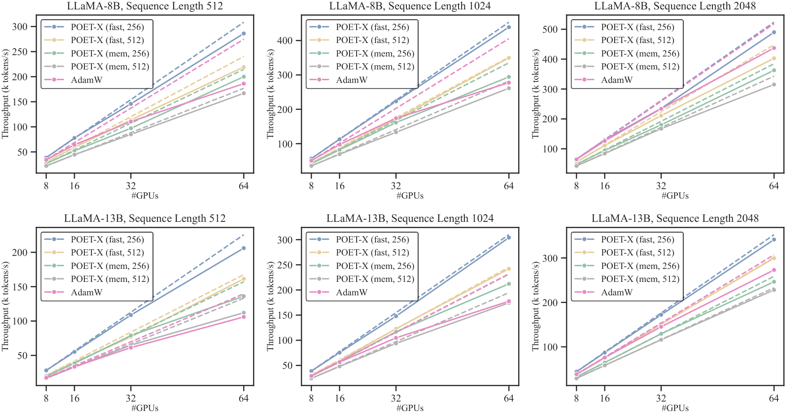

# POET-X: Memory-efficient LLM Training by Scaling Orthogonal Transformation

## TL;DR
这篇工作把 POET 的稳定训练路线从“理论上有吸引力”推进到“单卡也可能跑得动”的工程形态。

## 中文摘要
POET-X 是对 POET 的系统级改造版，目标是在保留谱保持和训练稳定性优势的同时，大幅降低内存与计算开销。摘要称它能显著改善吞吐和显存效率，并支持在单张 H100 上预训练十亿参数 LLM，而同设定下 AdamW 会直接爆显存。真正值得核对的是它是否在不同规模和任务上都保住了训练质量，因为这些细节摘要没有充分说明。

## Quick Facts
- Paper ID: `2603.05500v1`
- Authors: Zeju Qiu, Lixin Liu, Adrian Weller, Han Shi, Weiyang Liu
- Domain: Large Language Models
- Published: 2026-03-05T18:59:23Z
- arXiv: [abstract](https://arxiv.org/abs/2603.05500v1)
- PDF: [download](https://arxiv.org/pdf/2603.05500v1.pdf)
- Reading priority: high
- Why this priority: 工程价值直接，且摘要给出明确硬件对比；但仍需核对它是否真正保住了训练质量和可迁移性。

## Abstract Translation
大语言模型的高效且稳定训练仍是现代机器学习系统中的核心挑战。为解决这一问题，已有工作提出了重参数化正交等价训练（POET）：它通过对每个权重矩阵施加正交等价变换来优化参数，并保持谱性质不变。虽然 POET 在训练稳定性上表现强，但其原始实现因大量矩阵乘法而带来较高的显存占用和计算开销。为克服这些限制，本文提出 POET-X，这是一个可扩展且更省显存的变体，以显著更低的计算成本完成正交等价变换。POET-X 在保持 POET 泛化与稳定性收益的同时，显著提升了吞吐与显存效率。实验中，POET-X 可以在单张 Nvidia H100 GPU 上完成十亿参数级 LLM 的预训练；相比之下，标准优化器 AdamW 在相同设置下会因显存不足而失败。

## Research Background And Motivation
LLM 训练长期处在一个三难困境里：稳定性、吞吐和显存通常难以同时兼顾。POET 这类保持谱性质的训练框架提供了不同于 AdamW 的稳定训练路径，但原始实现的矩阵乘法、激活保存和正交参数化开销太大，导致它在大模型预训练里缺乏可扩展性。

## Problem Framing
本文要解决的不是“如何再设计一个新优化器目标”，而是如何把已有的 POET 路线真正扩展到大规模 LLM 预训练：在保留其谱保持和训练稳定性的前提下，显著降低显存占用与运行时开销。这个问题重要，因为很多结构化或更稳定的训练方法最后并不是败在思想上，而是败在系统实现成本上。

## Method Overview
POET-X 延续了 POET 的核心建模思路：用左右两个可训练正交矩阵对固定基权重做正交等价变换，从而在训练中保持谱性质，并在训练后把这些变换并回权重中，因此没有推理额外开销。它的主要创新不在目标函数，而在把这套正交变换的实现整体重写成可扩展版本：一方面把原先以权重矩阵为中心的计算改为以输入为中心的线性映射序列，减少中间激活和大矩阵操作；另一方面利用块稀疏、置换、Cayley-Neumann 参数化和自定义 CUDA/Triton kernel，系统性压缩正交变换在前向和反向传播中的显存与时间成本。

## Method Details
- 将原始 POET 的 weight-centric 实现改写为 input-centric 形式，把一次更新表示成若干线性映射，避免保存与权重矩阵相关的大型中间激活，从而降低反向传播显存压力。
- 利用块对角、块稀疏正交矩阵结构，不再显式构造完整的大型稀疏块对角矩阵，而是把每个块当作独立矩阵做 batch-parallel 乘法，减少无效存储并提升运行效率。
- 对置换操作做两层优化：一是通过索引映射实现自定义 CUDA 置换算子，避免显式构造置换矩阵；二是在内循环开始前把部分置换预先合并到固定权重中，减少重复置换次数。
- 重新实现 Cayley-Neumann Parameterization：只存 skew-symmetric 矩阵的上三角部分，将相关参数、梯度和优化器状态减半；同时重排 CNP 计算式，并用 Triton kernel 融合前向和反向中的共享张量读取与高阶项计算。
- 提出两种内存/计算权衡版本，其中一种沿用标准 autograd 保存额外激活，另一种通过 gradient checkpointing 在反向时重算所需张量；在此基础上进一步给出仅在 checkpointing 版本上可行的量化训练扩展 POET-XQ。

## Experimental Setup And Evidence
提取文本说明，实验分为三部分：一是单层 profiling，用于直接对比原始 POET、POET-X 与标准线性层在前向/反向中的时间与显存；二是大规模 LLM 预训练，对 Llama-3B 在 C4 数据集上的训练效果进行比较，基线包括 AdamW、Muon、GaLore、APOLLO；三是更细的效率消融，分析不同实现策略、不同计算规模下的运行时与显存。文中还提到一个多节点分布式设置：32 张 Nvidia H100 GPU（4 节点，每节点 8 卡）用于 wall-clock 收敛比较。更完整的超参数、模型结构、序列长度和附加实验在附录中，但提取文本没有充分说明。

## Main Results And Claims
提取文本支持的主要结论有三点。第一，相比原始 POET，POET-X 在单层基准上显著降低了前后向耗时；文中明确写到，总前后向时间从 10.59ms 降到 1.38ms 和 1.89ms（对应两个 POET-X 变体）。第二，论文在导言中声称，相比原始 POET，POET-X 达到约 3 倍 GPU 显存下降和约 8 倍运行速度提升，同时不牺牲原始 POET 的训练稳定性。第三，在 Llama-3B 的预训练比较中，提取文本称 POET-X 的验证困惑度优于 AdamW 及其他若干内存高效方法，但略逊于 Muon；同时其更高的显存效率带来了更好的 wall-clock 训练效率。关于“单张 H100 可训练到 13B 参数”与“AdamW 在同设定下显存不足”的说法，提取文本明确给出了该主张，但没有展开完整实验条件与边界。

## Research Or Engineering Value
如果文中的主张成立，POET-X 的实际价值很直接：它把一种原本更偏理论吸引力的稳定训练方法，推进到可能真正进入大模型预训练工程栈的形态。对资源受限团队，它意味着在更少显存预算下测试更大模型和更稳训练路径的机会；对研究者，它提供了一条不同于 AdamW 与低秩路线的替代方向，即通过结构化正交重参数化获得稳定性与效率的组合收益。POET-XQ 还说明这条路线有机会继续和量化训练结合，进一步压低内存门槛。

## Relation To Prior Work
相对常见的 AdamW 路线，这篇工作不是在一阶优化更新规则上做局部改动，而是通过正交等价变换重参数化权重，让训练过程在保持谱性质的约束下进行。相对 LoRA、GaLore、APOLLO 这类强调低秩或内存高效训练/微调的方法，POET-X 的核心不是附加一个参数高效模块，而是试图把正交结构化训练本身做成接近 PEFT 级别的显存占用。相对原始 POET，它的关键差异也不是理论性质变化，而是把“参数上稀疏”进一步落实成“系统上省显存、省时间”的具体实现，包括 input-centric 重写、置换预合并、块并行和 CNP kernel 融合。

## Overall Assessment
这篇论文最值得信的部分，是它把问题定义得很工程化且方法路径自洽：POET 的瓶颈确实主要来自正交变换实现成本，而文中给出的 input-centric 改写、块稀疏批并行、置换预处理、CNP 压缩与 fused kernel 形成了一条完整的降本链条，因此“它比原始 POET 更能跑”这件事高度可信。最该怀疑的部分，则是它是否在广泛设置下真正同时保住了训练质量、稳定性和系统收益。提取文本给出了若干强主张，例如单卡 H100 训练 13B、优于 AdamW、接近或优于多种高效方法，但缺少足够完整的实验上下文和数值展开。简言之，这篇文章很值得读，不是因为它已经无可置疑地证明了新范式成立，而是因为它把“正交重参数化训练”第一次明显推近了大模型工程可用区；真正需要仔细核对的是质量公平性、硬件依赖性和收益边界。

## Strengths
- 论文切入点明确：不是再做一个抽象优化器，而是把已有的稳定训练路线通过系统实现优化推到可扩展区间。
- 方法链条完整，覆盖输入中心化计算、块稀疏批并行、置换优化、CNP 压缩、kernel 融合、checkpointing 和量化扩展，说明作者关注的是端到端系统瓶颈而非单点技巧。
- 保留了 POET 的核心性质：正交等价变换、谱保持、训练后可并回权重、无推理额外开销，这一点使其区别于只在训练时做低秩附加模块的方法。
- 实验设置至少覆盖了单层 profiling、预训练表现和 wall-clock 效率，而不是只报一个吞吐数字。提取文本还给出了与 AdamW、Muon、GaLore、APOLLO 的对比框架。

## Future Work
- 核对不同模型规模、不同数据配方和不同训练长度下，POET-X 是否始终保留相对 AdamW 的质量优势，还是只在特定规模区间有效。
- 更系统地分析稳定性的来源与边界，例如训练曲线波动、梯度行为、超参数敏感性，以及与谱保持性质之间的因果关系。
- 验证其硬件可迁移性：当前收益是否依赖 H100、Triton/CUDA 特化 kernel，换到不同 GPU、编译栈或分布式配置后收益是否仍然成立。
- 进一步研究 POET-XQ 的质量-显存权衡，特别是在低比特权重量化和 checkpointing 同时启用时，对收敛和最终性能的影响。

## Reading Checklist
- 先看 Input-centric Implementation：这是全文最关键的系统改写点，要确认它具体减少了哪些中间激活、复杂度如何变化。
- 再看 Permutation Acceleration and Reduction：置换在这类结构化方法里常是隐藏瓶颈，需要核对自定义算子到底省的是显存、带宽还是 kernel launch 开销。
- 重点读 Efficient Cayley-Neumann Parameterization：这是正交约束保持与实际效率之间的核心桥梁，尤其要看只存上三角和 kernel fusion 是否改变数值稳定性。
- 读 Single-layer Benchmarking against POET：先确认 3x 显存下降、8x 加速以及 10.59ms 到 1.38/1.89ms 的结论是在什么精确设置下得到的。

## Core Contributions
- 提出 POET 的可扩展变体 POET-X，专门解决原方法的高显存和高计算瓶颈。
- 在不改变核心稳定训练动机的前提下，重新设计正交等价变换的执行方式。
- 给出单张 H100 预训练十亿参数 LLM 的可行性主张，并以 AdamW 显存不足作为对照。

## Why Read It
- 训练效率论文里少见同时抓稳定性和显存，切入点比常规优化器微调更有结构性。
- 单卡十亿参数的主张很硬，值得核对实现细节和真实边界。
- 如果你关心更稳的预训练，这篇论文提供了一个不同于 AdamW 路线的选择。

## Risks Or Limits
- 许多关键结论在提取文本里只有主张，没有足够完整的表格或数值支撑，例如最终验证困惑度、显存峰值、吞吐、训练 token 对齐方式等。
- “保持原始 POET 的泛化和稳定性收益”是核心卖点，但提取文本没有充分说明稳定性是如何测量的，也没有看到更细的失败案例或训练波动分析。
- 单张 H100 可训练 13B 或十亿级模型这一点很吸引人，但提取文本没有充分说明 batch size、序列长度、精度、并行策略、checkpointing/量化是否同时使用，因此复现实用边界不清楚。
- 与 Muon 的比较只被简要描述为质量略逊但显存更低，提取文本没有充分说明两者是否在相同训练预算、相同实现成熟度和相同系统栈下公平比较。

## Recommended For
- 做大模型预训练系统与优化器研究的读者
- 资源受限但想跑更大模型的工程师
- 关注训练稳定性与参数化方法的研究者

## Keywords
- LLM 训练
- 内存效率
- 正交等价变换
- POET-X
- 训练稳定性

## Figures

- Full asset manifest: [images/index.md](images/index.md)

## Abstract
Efficient and stable training of large language models (LLMs) remains a core challenge in modern machine learning systems. To address this challenge, Reparameterized Orthogonal Equivalence Training (POET), a spectrum-preserving framework that optimizes each weight matrix through orthogonal equivalence transformation, has been proposed. Although POET provides strong training stability, its original implementation incurs high memory consumption and computational overhead due to intensive matrix multiplications. To overcome these limitations, we introduce POET-X, a scalable and memory-efficient variant that performs orthogonal equivalence transformations with significantly reduced computational cost. POET-X maintains the generalization and stability benefits of POET while achieving substantial improvements in throughput and memory efficiency. In our experiments, POET-X enables the pretraining of billion-parameter LLMs on a single Nvidia H100 GPU, and in contrast, standard optimizers such as AdamW run out of memory under the same settings.

## Recommendation Signals
- Recommendation score: 8.2
- Relevance score: 3.0
- Recency score: 3.0
- Popularity score: 1.2
- Quality score: 1.2

## Assets
- Extracted assets are stored in the `images/` folder next to this page.
- Browse the image manifest here: [images/index.md](images/index.md)
