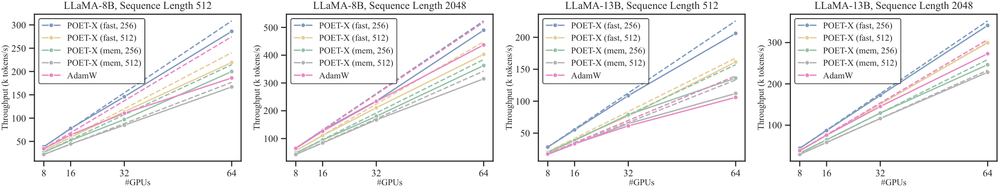
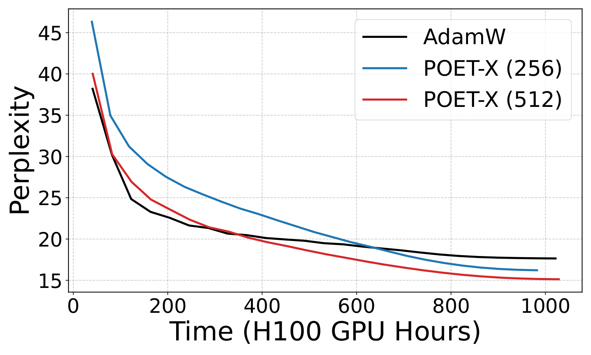
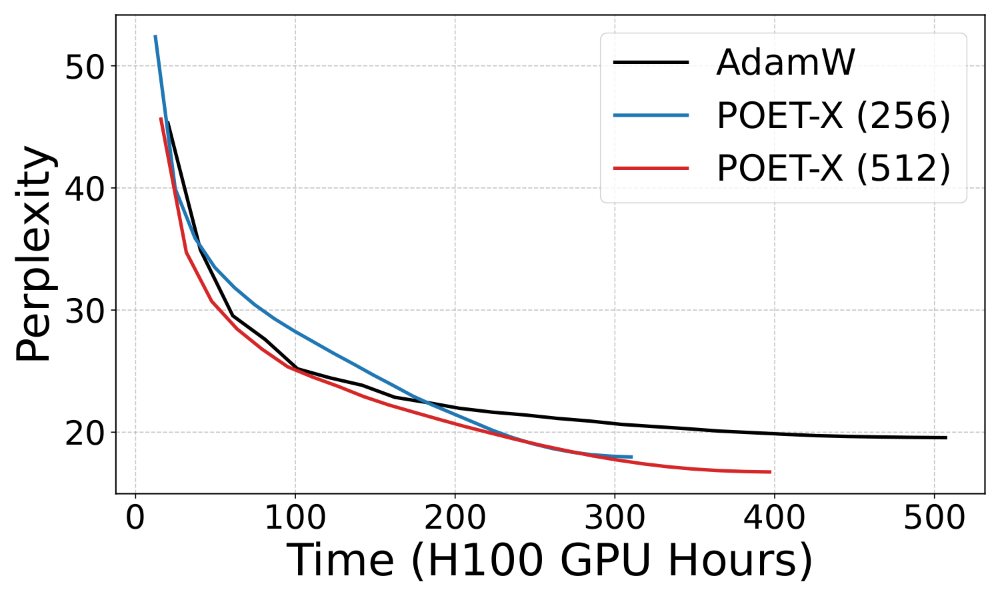

# POET-X: Memory-efficient LLM Training by Scaling Orthogonal Transformation

## TL;DR
这篇工作试图把原本稳定但昂贵的 POET 训练框架，改造成能在单张 H100 上训练十亿参数 LLM 的低显存版本。

## 中文摘要
大模型预训练同时受稳定性、吞吐和显存约束，原始 POET 虽强调通过正交等价变换保持谱性质，但实现代价较高。POET-X 声称在保留 POET 泛化与稳定性收益的同时，显著降低正交变换带来的计算和内存开销。摘要给出的核心吸引点是：它据称可在单张 Nvidia H100 上完成十亿参数级 LLM 预训练，而同设置下 AdamW 会显存溢出；但摘要没有充分说明具体复杂度变化、实验范围和收益幅度。

## Quick Facts
- Paper ID: `2603.05500v1`
- Authors: Zeju Qiu, Lixin Liu, Adrian Weller, Han Shi, Weiyang Liu
- Domain: Large Language Models
- Published: 2026-03-05T18:59:23Z
- arXiv: [abstract](https://arxiv.org/abs/2603.05500v1)
- PDF: [download](https://arxiv.org/pdf/2603.05500v1.pdf)
- Reading priority: high
- Why this priority: 主题高度贴合大模型训练主线，且把“稳定训练”与“显存/吞吐可行性”放在一起处理；摘要中的单卡十亿参数预训练主张很值得尽快核对，但阅读时应优先关注方法细节和实验公平性。

## Research Background And Motivation
随着 LLM 规模上升，训练侧的核心矛盾不只是算力不足，还包括优化稳定性与显存、吞吐之间的张力。像 POET 这类通过保持权重矩阵谱性质来改善训练稳定性的思路有研究价值，但若实现本身过于耗算和耗显存，就难以真正进入大规模预训练流程。

## Problem Framing
论文要解决的问题是：如何在不丢掉 POET 稳定性与泛化优势的前提下，把其高内存、高矩阵乘法开销的实现改造成可扩展的 LLM 训练方法。这件事重要，因为训练算法如果不能在现实硬件预算下运行，再好的优化性质也难以转化为实际能力。

## Method Overview
作者提出 POET-X，作为 POET 的可扩展、内存更友好的变体，核心仍是对每个权重矩阵做正交等价变换，但以更低的计算代价实现该过程。按摘要表述，它更像是对正交等价变换实现方式的重写，而不是仅靠调参来换取更低显存。

### Method Figure

## Experimental Setup And Evidence
摘要提供的证据是：作者声称 POET-X 在实验中保持了 POET 的泛化与稳定性收益，同时提升了吞吐并改善了显存效率；此外，它据称支持在单张 Nvidia H100 上进行十亿参数 LLM 预训练，而同设置下 AdamW 会显存溢出。摘要没有充分说明所用模型、数据、训练配方、对比基线、具体指标和提升幅度，因此目前只能把这些结论视为待正文核实的主张。

### Experiment Figure

## Research Or Engineering Value
如果这些主张成立，这篇工作对研究和工程都很有价值：研究上，它说明正交/谱保持类训练方法不一定必须以高系统成本为代价；工程上，它可能为受限显存环境下的大模型预训练提供一种比常规优化器更可行的训练路径，并降低单机训练更大模型的门槛。

## Reading Checklist
- POET-X 具体通过什么重参数化或近似，减少了正交等价变换的矩阵乘法和显存占用？复杂度如何变化？
- 所谓“保持泛化与稳定性收益”是在什么任务、模型规模和训练阶段上验证的？是否覆盖不同架构和数据设置？
- 与 AdamW 的对比是否在相同 batch size、序列长度、混合精度、激活检查点和并行策略下进行？如果换成更成熟的省显存训练栈，结论是否仍成立？

## Core Contributions
- 提出 POET-X，把原始 POET 的正交等价训练改造成更可扩展、显存更友好的版本。
- 声称在降低计算和内存开销的同时，保留了 POET 的稳定性与泛化收益。
- 给出面向 LLM 预训练的系统可行性主张：单张 H100 上训练十亿参数模型。

## Why Read It
- 它直接切中 LLM 训练成本与稳定性的交叉问题，关注点不是模型结构，而是训练机制本身。
- 如果方法成立，价值不只在优化性质，还可能改变单机可训练模型规模与吞吐上限。
- 摘要给出了一个很强的工程钩子：与 AdamW 的显存对比结论值得优先核对。

## Risks Or Limits
- 摘要没有交代 POET-X 的具体算法简化，当前难以判断它是原理性突破还是工程近似。
- 实验证据在摘要层面偏薄，没有具体数字、任务范围和消融，泛化与稳定性主张仍需谨慎。

## Recommended For
- 关注 LLM 预训练优化器、重参数化与训练稳定性的研究者
- 需要在单机或受限显存条件下训练大模型的系统工程师
- 评估正交约束、谱保持方法能否落地到大模型训练栈的读者

## Keywords
- POET-X
- 大语言模型训练
- 内存效率
- 正交等价变换
- 谱保持训练
- 单卡预训练

## Additional Figures

- Full asset manifest: [images/index.md](images/index.md)

## Abstract
Efficient and stable training of large language models (LLMs) remains a core challenge in modern machine learning systems. To address this challenge, Reparameterized Orthogonal Equivalence Training (POET), a spectrum-preserving framework that optimizes each weight matrix through orthogonal equivalence transformation, has been proposed. Although POET provides strong training stability, its original implementation incurs high memory consumption and computational overhead due to intensive matrix multiplications. To overcome these limitations, we introduce POET-X, a scalable and memory-efficient variant that performs orthogonal equivalence transformations with significantly reduced computational cost. POET-X maintains the generalization and stability benefits of POET while achieving substantial improvements in throughput and memory efficiency. In our experiments, POET-X enables the pretraining of billion-parameter LLMs on a single Nvidia H100 GPU, and in contrast, standard optimizers such as AdamW run out of memory under the same settings.

## Recommendation Signals
- Recommendation score: 8.2
- Relevance score: 3.0
- Recency score: 3.0
- Popularity score: 1.2
- Quality score: 1.2

## Assets
- Extracted assets are stored in the `images/` folder next to this page.
- Browse the image manifest here: [images/index.md](images/index.md)
